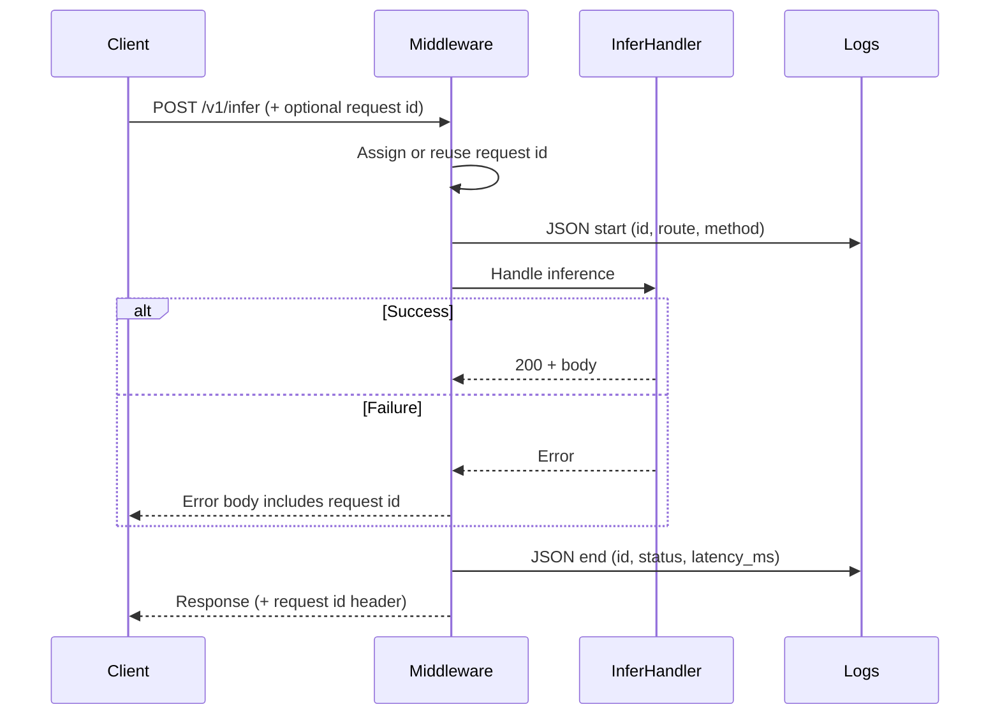

# Add structured logging and request correlation to the inference API

## Remember

- Exact file paths always
- Exact commands with expected output
- DRY, YAGNI, TDD, frequent commits
- Delegated tasks must be impossible to misread.

## Overview

The inference HTTP service today logs unstructured text and has no shared identifier across a request’s lifetime or error payloads. Operators cannot reliably join “call started,” “call finished,” and client-facing failures for a single inference attempt.

This plan adds request-scoped correlation and structured JSON access logs for every inference HTTP call: assign or accept a request id at the edge, emit start/end records with latency and status, and include that id on error responses. No metrics backend, tracing vendor, or cross-service propagation beyond this API is in scope.

**Fictional codebase context (for this example):** a small Python FastAPI service (`inference-api`) that exposes `POST /v1/infer` for model scoring, with a thin middleware stack, a shared error-response helper, and pytest-based API tests. Logging currently goes through the stdlib logger with free-form messages.

## Happy flow

A client calls the inference endpoint (optionally sending a request id). The service correlates the whole call under one id, writes JSON start and end logs with latency and status, and returns that id on success or error so operators can grep one request end-to-end.

## Approach

Prefer one edge middleware that owns correlation and access logging so handlers stay free of logging boilerplate. Reuse the existing error-response path to attach the request id rather than inventing a parallel error shape. Keep the log schema minimal and stable (id, timing, HTTP status, route) so a later metrics or tracing layer can consume the same fields without rewriting call sites.

## Decisions (resolved from open questions)

1. **Incoming header:** Accept `X-Request-ID`. Valid = non-empty string, max 128 chars, printable ASCII only (`0x20`–`0x7E`). Invalid or missing → generate a new UUID4 string.
2. **Success bodies:** Response header only; do not change success JSON payloads.
3. **Log destination:** stdout JSON only (one line per event). No dual human-readable formatter in this task.
4. **Route scope:** Middleware registered for the whole app. Access start/end logs emitted for all routes except `/health` and `/ready`. Request id is still assigned and echoed on those health routes.

## Steps

### Step 1: Define request-id and JSON log contracts

Lock header/validation rules, log event fields, and error-body field. Contracts and failing tests only. See [steps/step1.md](steps/step1.md).

### Step 2: Add correlation middleware

Resolve id, start/end JSON logs, latency, response header echo; skip access logs on health routes. See [steps/step2.md](steps/step2.md).

### Step 3: Attach request id to error responses

Shared error helper and exception handlers include the same request id on 4xx/5xx JSON bodies. See [steps/step3.md](steps/step3.md).

### Step 4: Verify end-to-end on the inference route

 Full `POST /v1/infer` success and failure coverage; confirm no metrics/tracing vendor deps. See [steps/step4.md](steps/step4.md).

## What "done" looks like

1. Every inference HTTP request has a single request id for its lifetime (accepted from the client when valid, otherwise generated).
2. That id is returned on the response (header) and present on error JSON bodies.
3. Each inference call emits structured JSON logs for start and end, including latency and HTTP status.
4. Handlers do not need ad-hoc request-id or access-log code for the happy path.
5. Tests cover id propagation, log shape, and error-body attachment; no Datadog/OpenTelemetry/metrics backend is introduced.
