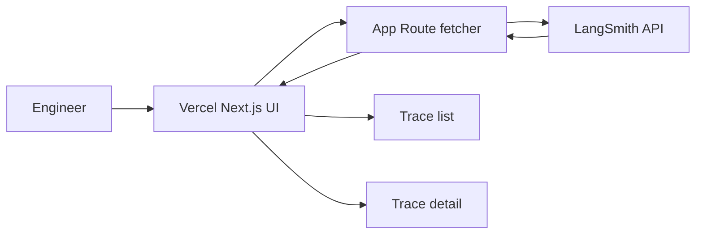

# Fetch one LangSmith project's recent traces and show them in a minimal Vercel UI

## Remember

- Exact file paths always
- Exact commands with expected output
- DRY, YAGNI, TDD, frequent commits
- Delegated tasks must be impossible to misread.

## Overview

Internal AI platform team ("Helix Ops") already logs agent runs to a single LangSmith project (`helix-staging-agents`). Engineers currently open LangSmith to inspect failures; they want a tiny read-only Vercel app on the company domain that lists recent traces for a fixed time window and opens one trace's summary locally—no multi-project picker, no streaming, no write-back to LangSmith.

## Happy flow

An engineer opens the deployed app, sees the latest traces for `helix-staging-agents` in the last 24 hours (name, status, latency, start time), clicks one row, and reads a single-trace detail view (inputs/outputs summary and error if any) fetched server-side from LangSmith.

## Approach

Keep one server-side exporter that calls LangSmith for list and get-by-id, plus two thin pages (list + detail). Secrets stay on the server; the UI never talks to LangSmith from the browser. Prefer the smallest Next.js App Router surface that deploys cleanly to Vercel.

## Decisions (resolved)

1. **Project:** Single project for v1; name comes only from server env (default value `helix-staging-agents`). No project picker in the UI.
2. **Time window:** Fixed last **24 hours**. No window control in the UI.
3. **Auth:** Rely on **Vercel Deployment Protection** for the deploy. No custom password gate or SSO in this plan.
4. **Repo path:** Greenfield app at `apps/langsmith-trace-viewer/`.
5. **List columns:** Name, status, latency, start time only. Run type and tags are out of scope for v1.

## Steps

### Step 1: Scaffold the Next.js app and LangSmith config

Create a minimal App Router project under `apps/langsmith-trace-viewer/`, wire env for LangSmith API key and project name, and confirm a local health page renders. See [steps/step1.md](steps/step1.md).

### Step 2: Implement the server-side trace fetcher

Add one module that lists recent runs for the configured project and time window and fetches a single run by id; cover list and detail paths with failing-then-passing tests against stubbed LangSmith responses. See [steps/step2.md](steps/step2.md).

### Step 3: Expose list and detail behind App Router handlers

Add server routes that call the fetcher, map failures to clear HTTP errors, and never expose the API key to the client. See [steps/step3.md](steps/step3.md).

### Step 4: Build the list and detail pages

Ship a list page of recent traces and a detail page for one trace id; keep layout plain (table + summary blocks). Capture before/after screenshots. See [steps/step4.md](steps/step4.md).

### Step 5: Deploy to Vercel and verify the happy path

Deploy the app, set production env and Deployment Protection, and confirm list loads and detail opens for a known recent run. See [steps/step5.md](steps/step5.md).

## What "done" looks like

1. A Next.js app exists at `apps/langsmith-trace-viewer/` and deploys to a Vercel preview/production URL.
2. Server-only config holds LangSmith API key and the single project name; client bundles do not contain the key.
3. Visiting `/` shows recent traces for that project in the last 24 hours.
4. Visiting a detail URL for a valid run id shows that run's summary (status, timing, inputs/outputs or error text).
5. Missing or failed LangSmith credentials produce an explicit error state, not an empty silent list.
6. Automated tests cover the fetcher's list and get-by-id success and failure paths.
7. Out of scope remains out of scope: no realtime streaming, no custom SSO/password gate, no multi-project switcher, no trace search/filter platform, no writes to LangSmith.
