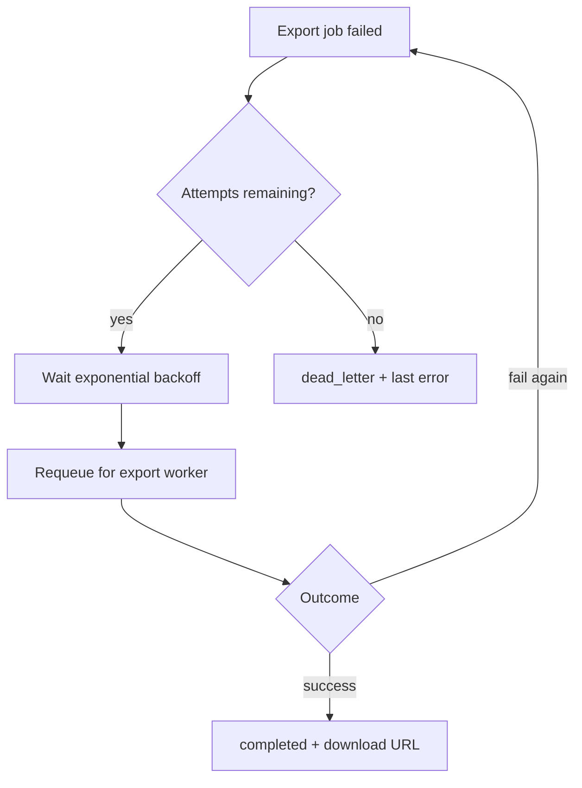

# Retry failed export jobs with exponential backoff

## Remember

- Exact file paths always
- Exact commands with expected output
- DRY, YAGNI, TDD, frequent commits
- Delegated tasks must be impossible to misread.

## Overview

Failed async CSV export jobs stay failed forever today. This plan adds a retry path that requeues eligible failures with exponential backoff, caps attempts, and moves exhausted jobs to dead letter with the last error preserved. No new export formats or API shapes.

**Fictional codebase context (example only):** A Python backend with an export API that enqueues jobs, a worker that runs query → CSV → object storage, and a job store holding statuses `pending` / `running` / `completed` / `failed`. Queue-driven; same stack as the existing async-export feature.

## Happy flow

An export fails transiently; the retry worker schedules it again after backoff. After success, status is completed with a download URL as today. After N failed attempts, status is dead letter and operators can inspect the last error.

## Approach

Reuse the existing export worker and job store; add a small retry scheduler that only owns backoff, attempt accounting, and the failed → pending / dead_letter transitions. Keep retry policy configuration-driven and leave create/poll/download paths unchanged.

## Decisions (resolved from review)

1. **Dead-letter visibility:** Existing export status poll returns `dead_letter` (same endpoint as other statuses). No separate admin-only path in v1.
2. **Retry defaults:** Max **5** attempts; backoff **30s × 2^(attempt − 1)**, capped at **15 minutes**.
3. **Process shape:** Separate **retry worker** process, same image/compose stack as the export worker (not in-process with the CSV worker).

## Steps

### Step 1: Extend job store for attempts and dead letter

Add attempt count and last-error retention on export jobs, plus a `dead_letter` status. Migration and read/write paths only—no scheduling yet. See [steps/step1.md](steps/step1.md).

### Step 2: Implement retry policy and eligibility

Define max attempts and exponential backoff delays. Select failed jobs that are past their next-retry time and under the attempt cap; exclude already completed, running, or dead-lettered jobs. See [steps/step2.md](steps/step2.md).

### Step 3: Wire retry worker loop

Run a dedicated retry worker process that claims eligible failures, bumps attempt count, requeues onto the existing export queue as pending, and on exhaustion marks dead letter with the last error. Do not change CSV generation or upload logic. See [steps/step3.md](steps/step3.md).

### Step 4: Prove retry and dead-letter behavior with tests

Cover: successful retry after one failure; backoff delay respected; exhaustion → dead letter with last error; jobs above the attempt cap never requeued; status poll surfaces `dead_letter`. See [steps/step4.md](steps/step4.md).

## What "done" looks like

1. Failed exports under the attempt limit are requeued after exponential backoff and can complete normally.
2. Exports that exhaust retries land in `dead_letter` with the last error retained.
3. Existing create / poll / download export behavior is unchanged for non-retry paths.
4. Max attempts and backoff base are configurable; defaults are documented (5 attempts, 30s base, 15m cap).
5. Automated tests cover happy retry, backoff gating, and dead-letter exhaustion.
6. `GET /exports/{id}` returns `dead_letter` when retries are exhausted.
