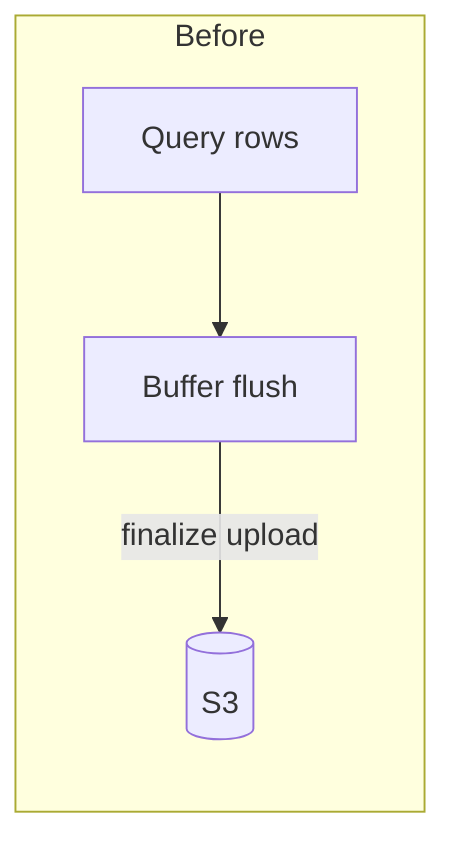
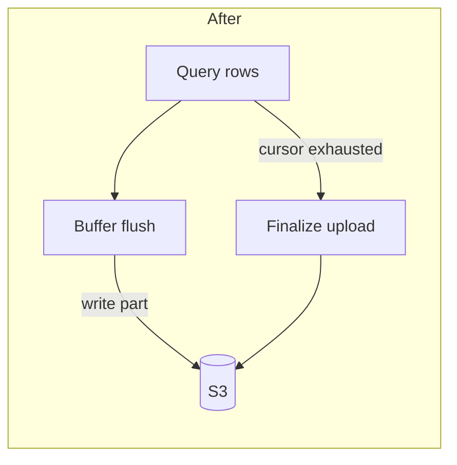

# Fix truncated CSV downloads for large exports

## Summary

Large CSV exports were truncated after ~100MB because the Export Worker finalized the S3 multipart upload when the local write buffer flushed, not when the query cursor finished.

Exports now stream until the query is exhausted, then finalize the upload and return a complete download URL.

## Purpose

Customers exporting result sets larger than ~100MB receive incomplete CSVs and cannot trust download contents for reporting or downstream loads.

This fix restores full-file exports on the async CSV path (Export API → Export Worker → Job Store → S3). Changing the synchronous query API response size limit is out of scope.

## Reproduction

Setup: a query whose CSV export exceeds ~100MB; API and worker running.

1. `POST /exports` with that `query_id` and `format: "csv"`.
2. Poll `GET /exports/{export_id}` until `status` is `completed`.
3. Download the file from `download_url`.
4. Compare downloaded row count to the query result count.

Expected: CSV row count matches the query result; file size is complete.

Actual: File ends early (~100MB); trailing rows are missing; job still reports `completed`.

## Root cause

The Export Worker treated each local buffer flush as end-of-upload and called S3 multipart completion early. Result sets that spanned multiple buffers never wrote later parts, so the object was truncated while the Job Store still marked the export `completed`.

## Fix

The worker now writes multipart parts on buffer flush but finalizes the S3 upload only after the query cursor is exhausted. Job status moves to `completed` only after finalize succeeds.





## How to verify

```bash
docker compose up api worker
```

1. Reproduce with a >100MB export (same steps as above).
2. Confirm downloaded CSV row count matches the query result.
3. Spot-check a small (<10MB) export still completes and downloads normally.
4. Confirm a failed query still yields `status: "failed"` with no download URL.
