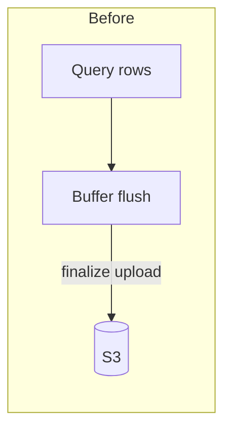
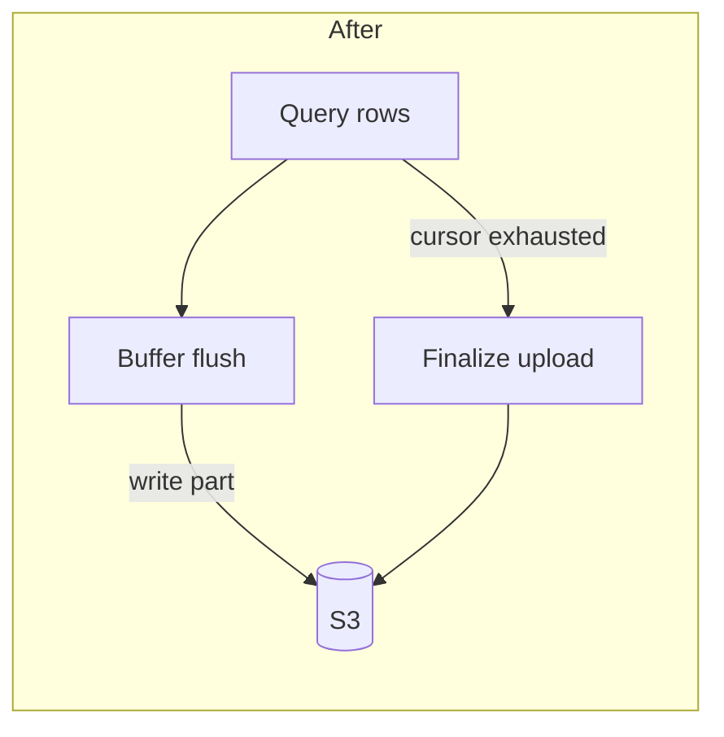

# PR Descriptions for Bug Fixes

A bug-fix PR description should let another engineer quickly understand:

1. What is broken.
2. How to reproduce it.
3. Why it happens.
4. What the fix changes.
5. How to verify the fix.
6. What risk or follow-up remains.

The description should explain the defect and the corrected behavior. It is not a feature README.

Keep Summary and Purpose a bit fuller if needed. Keep every other section terse.

## Outline

### 1. Title and metadata

Use a name that names the defect being fixed.

Good examples:

- Fix truncated CSV downloads for large exports
- Correct timezone handling in scheduled reports
- Prevent duplicate webhook deliveries on retry

Guidelines:

- Make titles maximum 1 sentence, with a clear action verb (`Fix`, `Correct`, `Prevent`, `Restore`).
- Titles should make the broken behavior obvious without reading the body.

### 2. Summary

The summary should explain what was wrong and what the fix restores.

It should answer:

- What incorrect behavior did users or callers observe?
- What is the corrected behavior after this change?

Guidelines:

- Max 2-3 sentences.
- Lead with the observable failure, then the corrected outcome.
- Mention the trigger or condition when it is part of understanding the bug.

Common anti-patterns:

- Listing code changes instead of describing broken vs fixed behavior.
- Repeating the title without explaining the failure mode.
- Jumping straight to the root cause without stating what broke.
- Including implementation details (e.g., variable names) that will become stale.

An example:

```markdown
Large CSV exports were truncated after ~100MB because the worker closed the
S3 upload stream when the local buffer flushed, not when the query finished.

Exports now stream until the query completes, then finalize the upload and
return a complete download URL.
```

### 3. Purpose

Explains why the bug matters and what impact the fix addresses.

The purpose can answer questions like:

- Who is affected, and under what conditions?
- What is the user or system impact (data loss, wrong results, outage, etc.)?
- How severe or frequent is the issue?
- What is in/out of scope for this fix?

Max 2-3 sentences here.

An example:

```markdown
Customers exporting result sets larger than ~100MB receive incomplete CSVs and
cannot trust download contents for reporting.

This fix restores full-file exports for the async CSV path. Changing the
synchronous query API response size limit is out of scope.
```

### 4. Reproduction

Document the minimum steps needed to observe the bug before the fix.

Include:

- Setup (data size, config, environment)
- Exact steps
- Expected vs actual result

Keep this short. Prefer a numbered list over narrative.

An example:

```markdown
## Reproduction

1. Create a query whose CSV export exceeds ~100MB.
2. `POST /exports` with that `query_id`.
3. Poll `GET /exports/{export_id}` until `completed`.
4. Download the file from `download_url`.

Expected: CSV row count matches the query result.
Actual: File ends early; last rows are missing.
```

### 5. Root cause

State the underlying reason the bug occurs. Be specific about the faulty assumption or boundary.

It should answer:

- Which component owns the incorrect behavior?
- What condition triggers it?
- Why did the existing logic fail?

Guidelines:

- Prefer one short paragraph, or a few bullets if multiple contributing factors matter.
- Name the fault precisely (e.g., "upload finalized on buffer flush" not "S3 issue").
- Do not restate the Summary.

An example:

```markdown
## Root cause

The export worker treated each local buffer flush as end-of-upload and called
S3 multipart completion early. For result sets that spanned multiple buffers,
later rows were never written.
```

### 6. Fix

Describe what changed and why that corrects the failure. Identify the primary components involved when helpful.

Focus on:

- The behavioral change
- Which component owns the corrected logic
- Any important boundary that moved (validation, state, async work, external I/O)

If the control flow changed, include a before/after Mermaid diagram. Keep diagrams small and centered on the failing path.

A reader should be able to answer:

- Where was the bug?
- What is different now?
- Does any contract, status, or side effect change for callers?

An example:

````markdown
## Fix

The worker now finalizes the S3 upload only after the query cursor is exhausted.
Buffer flushes write parts but no longer complete the multipart upload.




````

Only document interfaces when the fix changes an externally meaningful contract (status codes, payload shape, events, config). Otherwise omit that section.

### 7. How to verify

Provide a terse checklist or commands that confirm the bug is gone and no obvious regression was introduced.

Include:

- The original reproduction, showing the corrected result
- Any focused regression check tied to the failure mode
- Required services or setup, if not obvious

An example:

````markdown
## How to verify

```bash
docker compose up api worker
```

1. Reproduce with a >100MB export (same steps as above).
2. Confirm downloaded CSV row count matches the query.
3. Spot-check a small export still completes and downloads normally.
````

Verify that:

- Steps are current
- Required services are mentioned
- Paths assume a clear working directory
- Success criteria are explicit (what "fixed" looks like)
