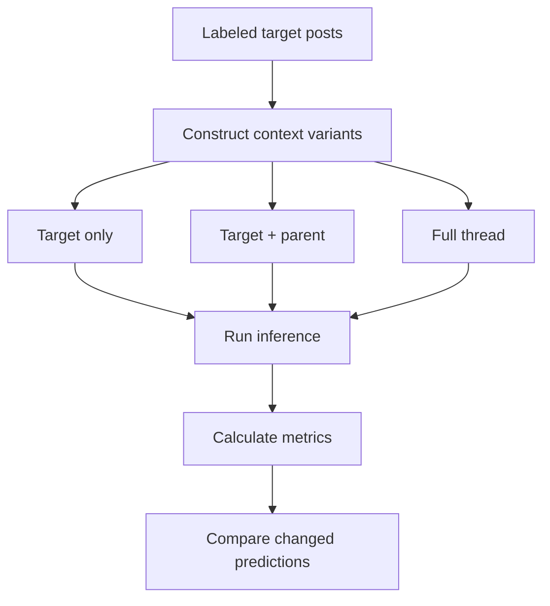

# Conversational Context Ablation

## Summary

Compared classification using the target post alone, the target post plus its direct parent, and the full preceding conversation thread.

Adding the direct parent improved recall and overall F1. Providing the full thread increased recall further but reduced precision, resulting in no additional improvement over the parent-only condition.

## Purpose

Determine how much conversational context should be provided when classifying a target post.

The experiment tests whether local context helps the model interpret replies, quotations, and ambiguous targets, and whether broader thread context introduces irrelevant or misleading information.

Prompt, model, decoding, and the set of target posts are fixed. Prompt wording and retrieval of non-contiguous thread turns are out of scope.

## Setup

- Dataset: `data/eval/test.csv`
- Model: `qwen3-32b`
- Prompt: `prompts/classification_v2.txt`
- Conditions:
  - Target post only
  - Target post plus direct parent
  - Full preceding thread
- Primary metric: F1 for `is_remove=1`
- Secondary metrics: Accuracy, precision, and recall
- Temperature: `0`
- Maximum context length: `8,192` tokens

The same target posts, prompt, model, and inference configuration were used in every condition. Only the amount of context included in the input changed.

## Flow

Stages:

- `Labeled posts` — fixed evaluation targets for every condition.
- `Context construction` — builds target-only, parent, and full-thread inputs.
- `Inference` — scores each variant with the same model and prompt.
- `Metrics` — computes accuracy, precision, recall, and F1; diffs changed predictions.



## Run

```bash
python run_experiment.py \
  --config configs/context_ablation.yaml
```

## Results

| Context         | Accuracy | Precision | Recall |   F1 |
| --------------- | -------: | --------: | -----: | ---: |
| Target only     |     0.70 |      0.63 |   0.55 | 0.59 |
| Target + parent |     0.71 |      0.62 |   0.61 | 0.61 |
| Full thread     |     0.69 |      0.58 |   0.64 | 0.61 |

Outputs:

- `outputs/predictions_target_only.csv`
- `outputs/predictions_target_and_parent.csv`
- `outputs/predictions_full_thread.csv`
- `outputs/context_comparison.csv`
- `outputs/changed_predictions.csv`
