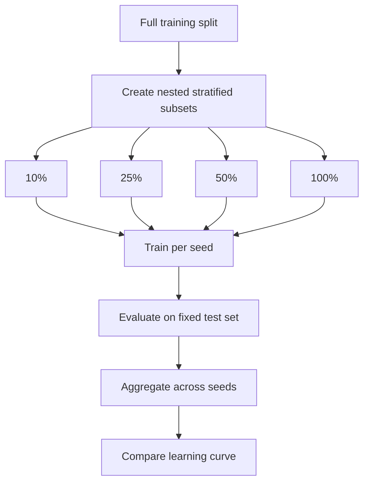

# Training-Set Size Ablation

## Summary

Trained the same ModernBERT classifier on 10%, 25%, 50%, and 100% of the available labeled training data.

Performance improved consistently as the training set grew, but the largest gains occurred before the 50% condition. Training on the full dataset produced the best result, although the improvement over 50% was comparatively small.

## Purpose

Measure how sensitive model performance is to the amount of labeled training data and identify a smaller subset suitable for faster development.

The experiment is intended to identify:

- Whether additional labeled data remains valuable
- A smaller training subset suitable for faster development
- Whether the current learning curve suggests prioritizing more labels or improvements to the modeling approach

## Setup

- Dataset: `data/splits/`
- Model: `modernbert-base`
- Conditions:
  - 10% of training data
  - 25% of training data
  - 50% of training data
  - 100% of training data
- Validation and test sets: Fixed across conditions
- Primary metric: F1 for `is_remove=1`
- Secondary metrics: Accuracy and ROC-AUC
- Seeds: `42`, `43`, and `44`
- Epochs: `5`
- Early stopping: Validation F1

## Flow

Stages:

- `Training data` — full labeled train split; source of nested stratified subsets.
- `Subset construction` — 10% / 25% / 50% / 100% nested draws, repeated per seed.
- `Train` — same ModernBERT recipe and early stopping on the shared validation set.
- `Evaluate` — scores each trained model on the fixed test set; aggregates across seeds.



## Run

```bash
python run_experiment.py \
  --config configs/training_size_ablation.yaml
```

## Results

Results are averaged across three random seeds.

| Training data | Accuracy |   F1 | ROC-AUC |
| ------------: | -------: | ---: | ------: |
|           10% |     0.63 | 0.43 |    0.66 |
|           25% |     0.66 | 0.49 |    0.70 |
|           50% |     0.69 | 0.54 |    0.73 |
|          100% |     0.69 | 0.56 |    0.74 |

Outputs:

- `outputs/run_metrics.csv`
- `outputs/aggregate_metrics.csv`
- `outputs/learning_curve.png`
- `outputs/predictions/`
