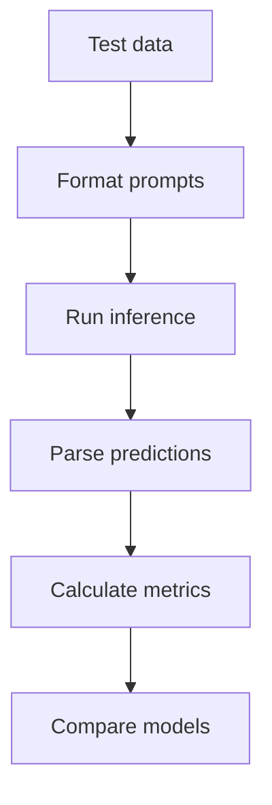

# Zero-Shot Model Comparison

## Summary

Compared Qwen3-8B, Qwen3-32B, and Ministral-3-14B on the same zero-shot post-removal classification task.

Qwen3-32B achieved the strongest overall performance and the highest positive-class F1 score. Qwen3-8B performed worse but remained competitive enough to serve as a lower-cost model for development and iteration.

## Purpose

Select two baselines for subsequent experiments:

- A quality baseline representing the strongest available model
- A lower-cost baseline suitable for prompt iteration, pipeline testing, and fine-tuning

The experiment also tests whether the performance improvement from using a larger model is meaningful for this task.

## Setup

- Dataset: `data/eval/test.csv`
- Models:
  - `qwen3-8b`
  - `qwen3-32b`
  - `ministral-3-14b`
- Prompt: `prompts/zero_shot_v1.txt`
- Primary metric: F1 for `is_remove=1`
- Secondary metrics: Accuracy, precision, and recall
- Temperature: `0`

## Flow

Stages:

- `Test data` — shared evaluation set for every model.
- `Prompt format` — renders the same zero-shot template per example.
- `Inference` — runs each model independently with the same decoding.
- `Metrics` — parses labels, computes metrics, and compares models on the same items.



## Run

```bash
python run_experiment.py \
  --config configs/zero_shot_model_comparison.yaml
```

## Results

| Model           | Accuracy | Precision | Recall |   F1 |
| --------------- | -------: | --------: | -----: | ---: |
| Qwen3-8B        |     0.68 |      0.57 |   0.51 | 0.54 |
| Qwen3-32B       |     0.71 |      0.63 |   0.58 | 0.60 |
| Ministral-3-14B |     0.69 |      0.59 |   0.54 | 0.56 |

Outputs:

- `outputs/predictions_<model>.csv`
- `outputs/model_comparison.csv`
- `outputs/metrics.json`
