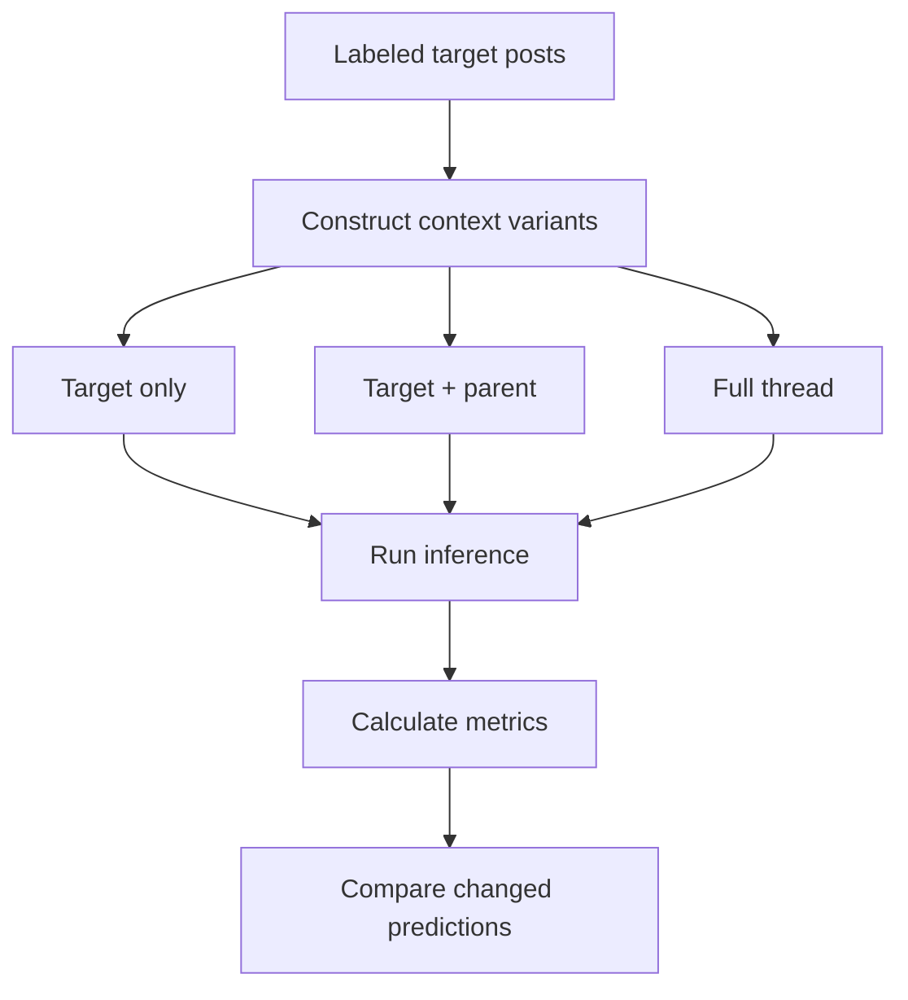

# Experiment PR description Guide

A PR description for experiments should let another researcher quickly understand:

1. What was tested
2. Why it was tested
3. How the experiment worked
4. How to rerun it
5. What happened
6. What decision follows from the results

The description is not intended to be a full research report. It should act as a compact experiment record and entry point into the code and outputs.

The tone and voice here is intended to be presentation-worthy, McKinsey-style executive summary reporting of explicit details. Avoid verbosity, excessive bolding, inaccurate statements, as well as too much domain-specific terms. Assume that the audience is broadly aware of the project but needs context and explanation of specific terms or setup choices.

## 1. Title and metadata

```markdown
# <Experiment Name>
```

Use a descriptive title that identifies the experimental variable or comparison.

Good titles:

* `Zero-Shot Model Comparison`
* `Training-Set Size Ablation`
* `Conversational Context Ablation`
* `Prompt Example Count Ablation`

Avoid generic titles:

* `Experiment 4`
* `Model Test`
* `New Results`

The folder name or experiment ID can contain the project slug, sequence number, and date. The description title should remain human-readable.

---

## 2. Summary

The summary should explain the experiment and its main result in two short paragraphs.

The first paragraph should answer:

> What did this experiment compare or test?

The second should answer:

> What was the main result?

Recommended length: **3–6 sentences**.

```markdown
## Summary

Compared <conditions, models, or methods> on <task or dataset>.

<Condition> produced the strongest result. <Secondary finding or tradeoff>.
```

A reader should be able to stop after this section and still understand the experiment at a high level.

### Good example

```markdown
## Summary

Compared classification using the target post alone, the target post plus its
direct parent, and the full preceding conversation thread.

Adding the direct parent improved recall and overall F1. Providing the full
thread increased recall further but reduced precision, resulting in no
additional improvement over the parent-only condition.
```

### Common problems

* Describing the implementation without stating the result
* Repeating the experiment title without adding information
* Including detailed metric tables in the summary
* Claiming more than the experiment demonstrates
* Writing the summary before the experiment and never updating it

---

## 3. Purpose

The purpose should explain the research or engineering decision the experiment supports.

It should answer:

> Why was this experiment worth running?

> What question or uncertainty does it resolve?

Recommended length: **1–3 short paragraphs or a paragraph followed by up to three bullets**.

```markdown
## Purpose

Determine whether <experimental variable> improves <desired outcome>.

The experiment is intended to identify:

- <decision or question 1>
- <decision or question 2>
- <decision or question 3>
```

Weak:

```markdown
Test four different training-set sizes.
```

Stronger:

```markdown
Measure how sensitive model performance is to the amount of labeled training
data and identify a smaller subset suitable for faster development.
```

---

## 4. Setup

The setup should capture the minimum information needed to interpret the experiment.

Typical fields include:

```markdown
## Setup

- Dataset:
- Model or method:
- Experimental conditions:
- Prompt or configuration:
- Primary metric:
- Secondary metrics:
- Important fixed parameters:
```

Only include fields that matter for the experiment.

### Experimental conditions

Clearly identify what changed between conditions.

```markdown
- Conditions:
  - Target post only
  - Target post plus direct parent
  - Full preceding thread
```

Also identify what remained fixed when that is important:

```markdown
The same target posts, prompt, model, and inference configuration were used in
every condition. Only the amount of context changed.
```

This helps readers understand what conclusions the experiment can support.

---

## 5. Flow

The flow should show the happy path through the experiment as pipeline stages.

Include:

- A short list of named stages with one-line responsibilities
- A Mermaid flowchart of those stages

Prefer branching when conditions differ (fork per condition, join at scoring). Use a linear diagram only when the sole variable is which model or size runs the same path. Use before/after diagrams only if this PR changes the experiment harness itself.

A reader should be able to answer:

- What is shared across conditions?
- Where does the path fork?
- Where are metrics computed?

Weak: a file chain (`main.py` → `utils.py` → `metrics.py`), ASCII arrows, or invented services (`Metrics Service`) that are not real components.

An example:

````markdown
## Flow

Stages:

- `Labeled posts` — fixed evaluation targets for every condition.
- `Context construction` — builds target-only, parent, and full-thread inputs.
- `Inference` — scores each variant with the same model and prompt.
- `Metrics` — computes accuracy, precision, recall, and F1; diffs changed predictions.


````

---

## 6. Run

Provide the canonical command for reproducing the experiment. Note the expected observable (metrics table written, artifacts produced) when it is not obvious.

```bash
python run_experiment.py \
  --config configs/<experiment>.yaml
```

The command should represent the normal happy path. Do not list every possible flag unless those variants are central to understanding the experiment.

Before finalizing the description, verify that:

- The command is current
- The referenced configuration exists
- Paths are relative to the expected working directory
- Required setup is documented elsewhere or obvious from the project

---

## 7. Results

Present the smallest result set needed to support the conclusion.

```markdown
## Results

| Condition | Accuracy | Precision | Recall | F1 |
|---|---:|---:|---:|---:|
| Condition A | | | | |
| Condition B | | | | |
````

Use the primary metric plus only the secondary metrics needed to explain important tradeoffs.

For example, precision and recall are useful when two conditions have the same F1 but fail differently. They may be unnecessary for an experiment concerned only with latency.

List the main generated artifacts when they help readers continue the analysis:

```markdown
Outputs:

- `outputs/predictions.csv`
- `outputs/metrics.json`
- `outputs/comparison.csv`
```

Do not copy every output file into the description. Just mention the key files.
