# <Experiment Name>

## Summary

Compared <conditions or methods> on <task, dataset, or evaluation>.

<Main result>. <Important secondary finding or tradeoff>.

## Purpose

Determine whether <experimental variable> affects <outcome or decision>.

The experiment is intended to identify:

- <question or decision>
- <question or decision>
- <question or decision>

## Setup

- Dataset:
- Model or method:
- Conditions:
- Prompt or configuration:
- Primary metric:
- Secondary metrics:
- Random seeds:
- Important fixed parameters:

## Flow

Stages:

```mermaid
flowchart TD
  In[<Input data>] --> Prep[<Prepare conditions>]
  Prep --> A[<Condition A>]
  Prep --> B[<Condition B>]
  A --> Run[<Run experiment>]
  B --> Run
  Run --> Metrics[<Calculate results>]
  Metrics --> Compare[<Compare conditions>]
```

- `<Stage>` — <responsibility>
- `<Stage>` — <responsibility>
- `<Stage>` — <responsibility>
- `<Stage>` — <responsibility>



## Run

```bash
python run_experiment.py \
  --config configs/<experiment>.yaml
```

## Results

| Condition | Primary metric | Secondary metric |
| --------- | -------------: | ---------------: |
|           |                |                  |
|           |                |                  |

Outputs:

* `outputs/<artifact>`
* `outputs/<artifact>`
