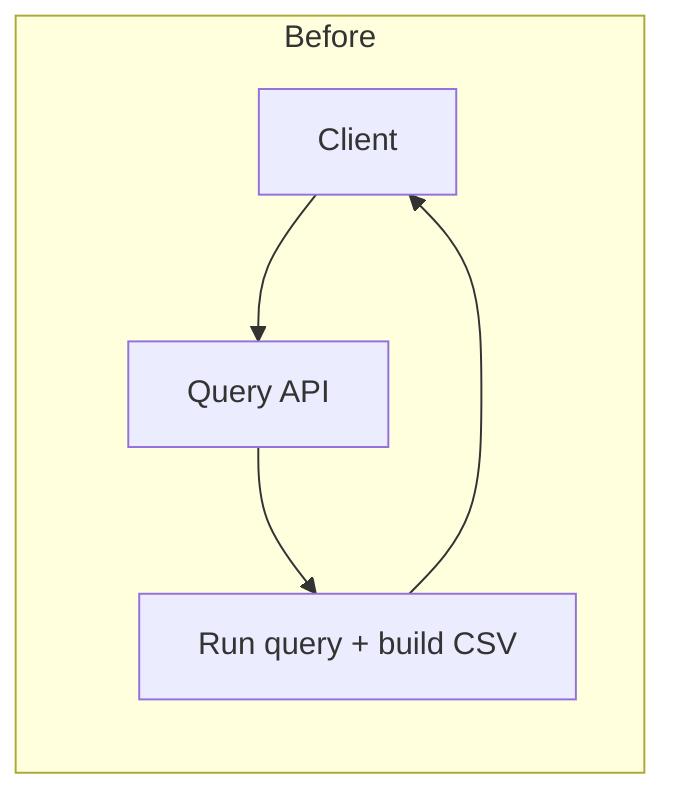
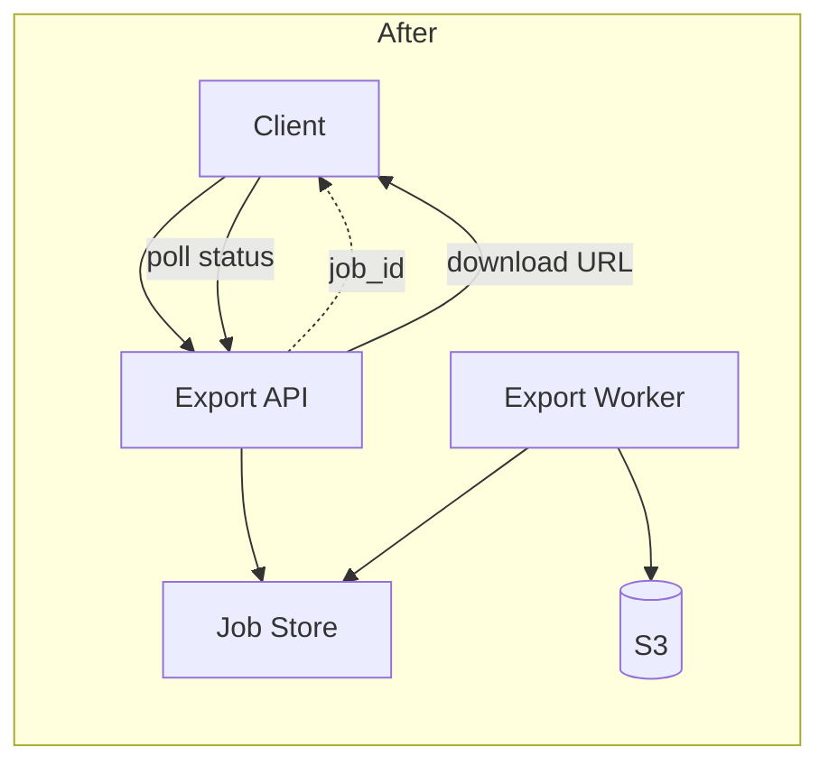

# Implementing asynchronous CSV exports

## Summary

Adds asynchronous CSV exports for queries that are too large to return in a normal API response.

The API creates an export job and returns a job identifier immediately. A background worker generates the file, stores it in S3, and exposes a temporary download URL when processing completes.

## Purpose

Currently, users must wait for long-running queries to complete before receiving results. This leads to a poor user experience, with a possibility of a long-running job erroring out after a long wait.

This feature introduces asynchronous CSV exports, allowing users to poll for status and download results when ready. Streaming row-by-row responses and non-CSV formats are out of scope.

## Architecture

Components:

- `Export API` — validates the request, creates an export job, returns a job ID.
- `Export Worker` — runs the query, writes CSV, uploads to S3, updates job status.
- `Job Store` — holds job state (`pending` / `running` / `completed` / `failed`).
- `S3` — stores the generated CSV; the worker writes a temporary download URL on completion.

Existing flow:



New flow:



## Interfaces

### Endpoints

`POST /exports`

Request:

```json
{"query_id": "query_123", "format": "csv"}
```

Response (`202 Accepted`):

```json
{"export_id": "exp_456", "status": "pending"}
```

`GET /exports/{export_id}`

Response:

```json
{
  "export_id": "exp_456",
  "status": "completed",
  "download_url": "https://...",
  "expires_at": "2026-07-24T18:00:00Z"
}
```

### Job record

Stored in the job store. Worker and API share this shape.

| Field | Type | Notes |
| --- | --- | --- |
| `export_id` | `string` | Primary key |
| `query_id` | `string` | Source query |
| `format` | `"csv"` | Extensible later |
| `status` | `pending \| running \| completed \| failed` | |
| `s3_key` | `string \| null` | Set on success |
| `error` | `string \| null` | Set on failure |

### Queue message

Published when an export is created. Consumed by the export worker.

```json
{
  "export_id": "exp_456",
  "query_id": "query_123",
  "format": "csv",
  "requested_at": "2026-07-23T17:00:00Z"
}
```

### Configuration

- `EXPORT_BUCKET` — bucket containing generated exports
- `EXPORT_TTL_HOURS` — export retention period; defaults to `24`
- `EXPORT_QUEUE_URL` — worker input queue

## How to run

```bash
docker compose up api worker
```

```bash
curl -X POST localhost:8000/exports \
  -H 'Content-Type: application/json' \
  -d '{"query_id": "query_123", "format": "csv"}'
```

Expected: `202` with `export_id` and `status: "pending"`.

```bash
curl localhost:8000/exports/exp_456
```

Expected: eventually `status: "completed"` with a temporary `download_url`.
