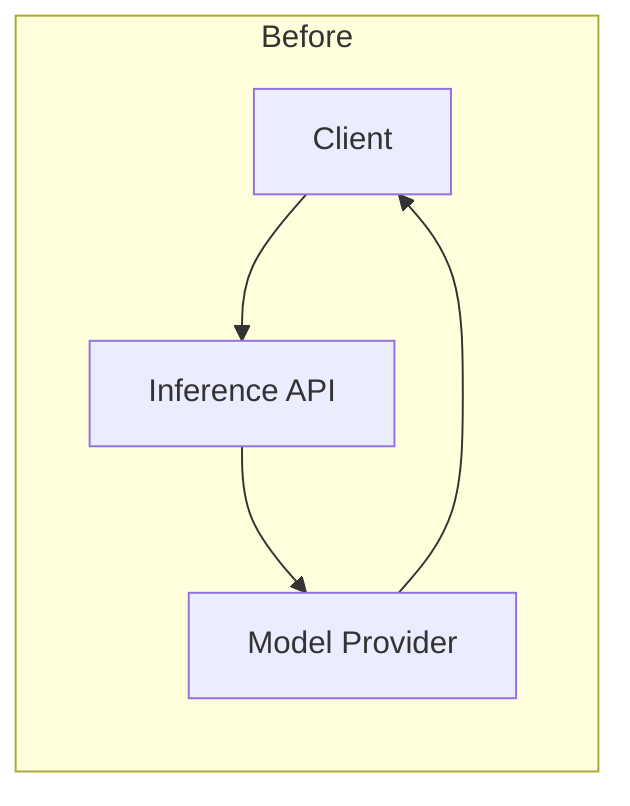
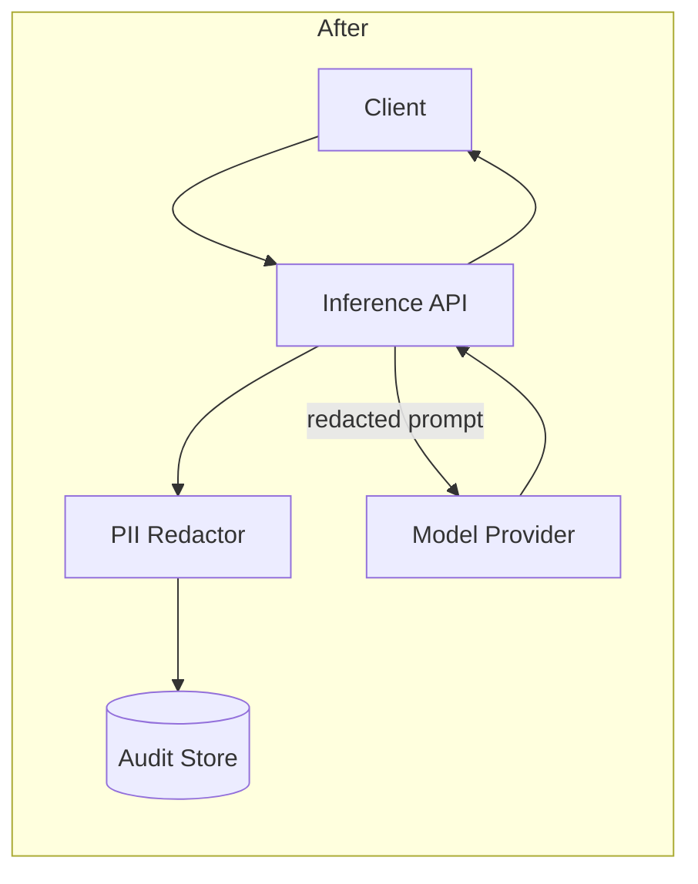

# Redact PII from LLM inputs

## Summary

Adds a PII redaction step that runs on all text before it is sent to an LLM provider.

Callers submit the original prompt payload and receive a redacted copy plus a compact audit record of what was masked. Emails, phone numbers, and government ID patterns are replaced with stable placeholders so downstream prompts remain structurally valid.

## Purpose

Prompts often contain user-authored text that includes personal identifiers. Sending that content verbatim to an external model provider creates compliance risk and makes it harder to reuse logs safely.

This feature redacts known PII categories at the boundary before provider calls. Free-form name detection, image OCR, and post-response redaction are out of scope.

## Architecture

Components:

- `Inference API` — accepts the request, invokes redaction, then calls the model provider.
- `PII Redactor` — owns detection rules, placeholder assignment, and the audit summary.
- `Audit Store` — stores redaction metadata keyed by request ID (not the raw PII values).
- `Model Provider` — receives only the redacted prompt.

Existing flow:



New flow:



## Interfaces

### Endpoint behavior

`POST /v1/completions` is unchanged for callers. Redaction runs inside the handler before the provider call.

Optional response field when `include_redaction_audit=true`:

```json
{
  "redaction": {
    "request_id": "req_789",
    "entities_masked": [
      {"type": "email", "count": 2},
      {"type": "phone", "count": 1}
    ]
  }
}
```

### Redactor contract

Input: raw prompt string (and optional structured message list).  
Output:

```json
{
  "text": "Contact user at {{EMAIL_1}} or {{PHONE_1}}",
  "entities": [
    {"type": "email", "placeholder": "{{EMAIL_1}}"},
    {"type": "phone", "placeholder": "{{PHONE_1}}"}
  ]
}
```

Placeholders are stable within a single request so repeated values map to the same token.

### Configuration

- `PII_REDACTION_ENABLED` — feature flag; default `true`
- `PII_ENTITY_TYPES` — comma-separated allowlist; default `email,phone,gov_id`
- `PII_AUDIT_TTL_DAYS` — audit retention; default `30`

## How to run

```bash
docker compose up api
```

```bash
curl -X POST localhost:8000/v1/completions \
  -H 'Content-Type: application/json' \
  -d '{
    "prompt": "Email jane@example.com at +1-555-0100",
    "include_redaction_audit": true
  }'
```

Expected: provider sees placeholders instead of raw PII; response includes `redaction.entities_masked` counts.
