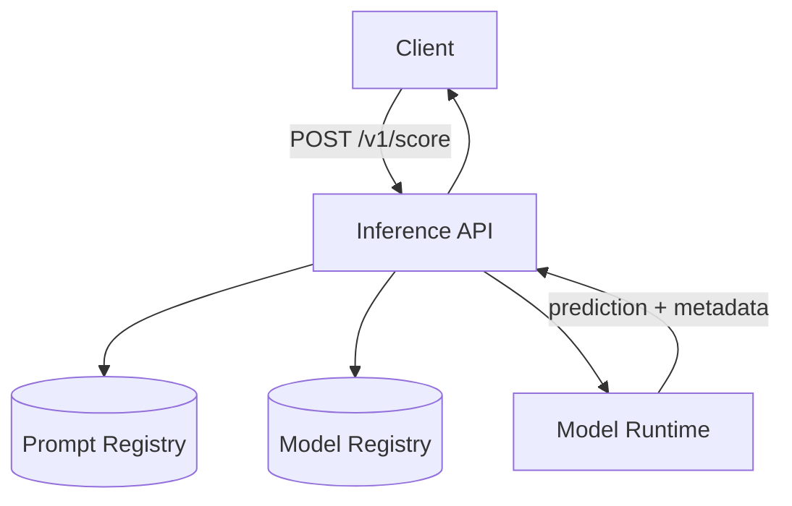

# Serve model inference with versioned prompts

## Summary

Adds a scoring API that loads a pinned model and prompt version for each request and returns predictions with serving metadata.

Callers specify `model_id` and `prompt_version` (or rely on the configured defaults). If either artifact is missing, the request fails closed rather than falling back to an implicit latest version.

## Purpose

Ad-hoc prompt edits and floating “latest” model pointers make production predictions hard to reproduce and hard to compare against offline evals.

This feature makes model and prompt versions explicit request contracts so online inference matches a known eval snapshot. Prompt authoring UI and automatic canary promotion are out of scope.

## Architecture

Components:

- `Inference API` — validates the request, resolves versions, returns predictions and metadata.
- `Prompt Registry` — stores immutable prompt templates keyed by `(task, prompt_version)`.
- `Model Registry` — resolves `model_id` to a loadable artifact URI.
- `Model Runtime` — runs inference for the resolved model.



Validation of `model_id` / `prompt_version` happens in the API before runtime invocation. Prompt rendering owns template substitution; the runtime only scores the fully rendered input.

## Interfaces

### Endpoint

`POST /v1/score`

Request:

```json
{
  "text": "user post goes here",
  "model_id": "classifier-v3",
  "prompt_version": "classification_v2"
}
```

Response:

```json
{
  "label": "remove",
  "score": 0.91,
  "metadata": {
    "model_id": "classifier-v3",
    "prompt_version": "classification_v2",
    "latency_ms": 42
  }
}
```

Missing model or prompt version → `404` with a stable error code (`model_not_found` / `prompt_not_found`).

### Prompt record

| Field | Type | Notes |
| --- | --- | --- |
| `task` | `string` | e.g. `classification` |
| `prompt_version` | `string` | Immutable once published |
| `template` | `string` | Must include `{{text}}` |
| `created_at` | `string` | ISO-8601 |

### Configuration

- `DEFAULT_MODEL_ID` — used when request omits `model_id`
- `DEFAULT_PROMPT_VERSION` — used when request omits `prompt_version`
- `PROMPT_REGISTRY_PATH` — local or remote registry root
- `MODEL_REGISTRY_URI` — model artifact index

## How to run

```bash
docker compose up api
```

```bash
curl -X POST localhost:8000/v1/score \
  -H 'Content-Type: application/json' \
  -d '{
    "text": "example post",
    "model_id": "classifier-v3",
    "prompt_version": "classification_v2"
  }'
```

Expected: prediction plus `metadata.model_id` / `metadata.prompt_version` echoing the requested versions.
