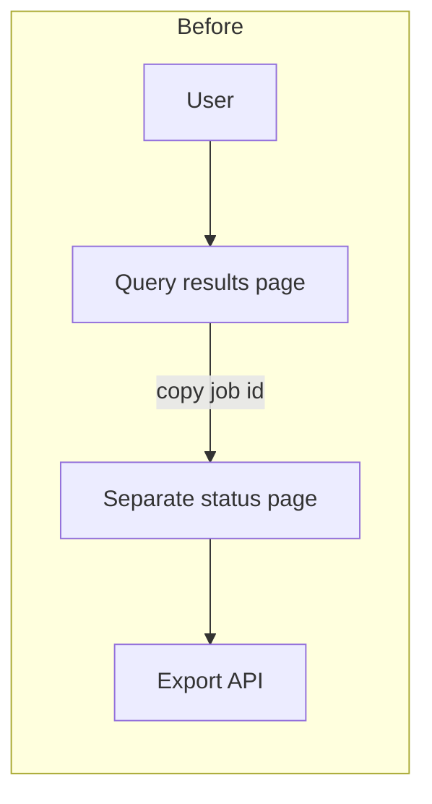
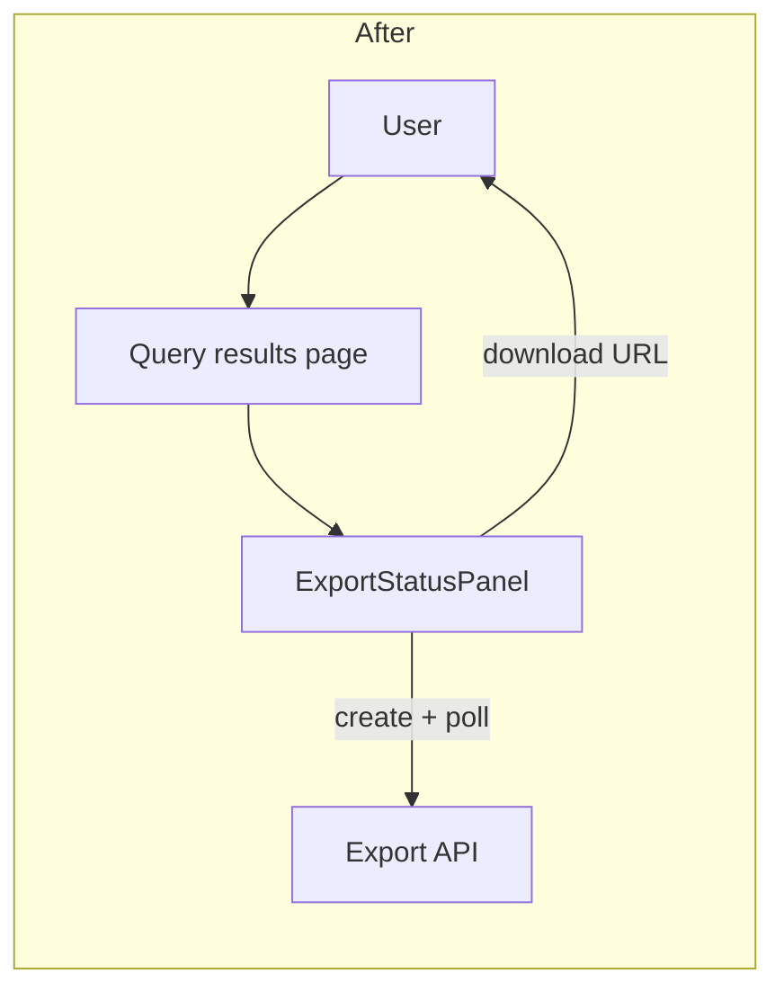

# Add export status panel to the query results UI

## Summary

Adds a status panel on the query results page so users can start an async CSV export and track it without leaving the page.

Users click **Export CSV**, see job status update in place (`pending` → `running` → `completed`), and download the file when a temporary URL appears.

## Purpose

Large exports previously required copying a job ID and polling a separate status page, which made the async export flow easy to abandon mid-job.

This feature keeps create, poll, and download on the query results page. Bulk multi-query export and email-when-ready notifications are out of scope.

## Architecture

Components:

- `QueryResultsPage` — entry point; hosts the export action and status panel.
- `ExportStatusPanel` — polls job status and renders progress / download link.
- `Export API` — existing `POST /exports` and `GET /exports/{export_id}` contracts.
- `Job Store` — source of truth for export status (unchanged).

Existing flow:



New flow:



## Interfaces

### UI contract

| Element | Behavior |
| --- | --- |
| **Export CSV** button | Calls `POST /exports` with the current `query_id` |
| Status text | Shows `pending` / `running` / `completed` / `failed` |
| **Download** link | Visible only when `status=completed`; opens `download_url` |
| Error banner | Shown when `status=failed`; displays `error` from the API |

### API (unchanged)

Uses existing export endpoints:

- `POST /exports` → `{ export_id, status }`
- `GET /exports/{export_id}` → status payload including optional `download_url`

### Configuration

- `EXPORT_POLL_INTERVAL_MS` — client poll interval; default `2000`
- `EXPORT_POLL_TIMEOUT_MS` — stop polling after this duration; default `600000`

## How to run

```bash
docker compose up api worker web
```

```bash
# open the app, run a large query, then click Export CSV on the results page
open http://localhost:3000/queries/query_123
```

Expected: status panel appears inline, transitions to `completed`, and shows a working download link.

## Screenshots

### Before


### After


