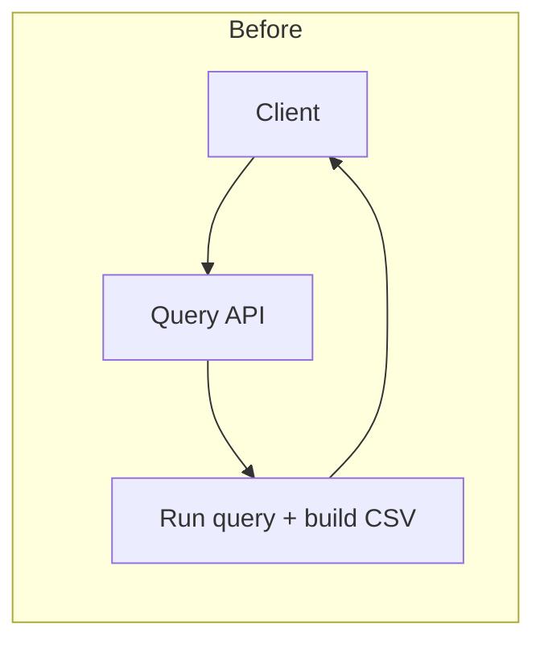
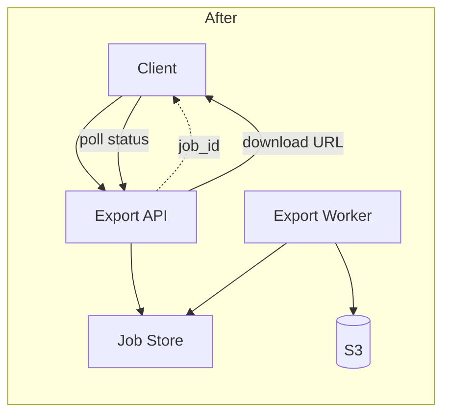

# PR Descriptions for Feature Development

A feature-specific README should let another engineer quickly understand:

1. What capability exists.
2. Why it was added.
3. Where it fits in the system.
4. How its main flow works.
5. How to use, test, and operate it.
6. What limitations/risks/open-ended parts remain.

The README should describe the feature's current behavior.

## Outline

### 1. Title and metadata

Use a name that names the capability introduced.

Good examples:

- Implementing asynchronous CSV exports
- Redact PII from LLM inputs.
- Deduplicate datasets using Athena.

Guidelines:

- Make titles maximum 1 sentence, with a clear action verb.
- Titles should make it abundantly clear the purpose of the PR.

### 2. Summary

The summary should explain what the feature does and its most important behavior.

It should answer:

- What capability does this add?
- How does it behavior, from the caller's perspective?

Guidelines:

- Max 2-3 sentences.
- Should clearly reference the problem being addressed.
- Should clearly describe the solution and how it solves the problem.

Common anti-patterns:

- Listing code changes instead of describing behavior.
- Repeating the title without explaining the feature.
- Describing internal details without explaining the user-facing capability.
- Includes implementation details (e.g., variable names) that will become stale.

An example:

```markdown
Adds asynchronous CSV exports for queries that are too large to return in a normal API response.

The API creates an export job and returns a job identifier immediately. A background worker
generates the file, stores it in S3, and exposes a temporary download URL when processing completes.
```

### 3. Purpose

Explains the problem being solved and the decision behind the future.

The purpose can answer questions like:

- Why does this feature need to exist?
- What system or user problems does it solve?
- What is in/out of scope?

This should also describe any user journeys that are relevant for the feature being solved.

Max 2-3 sentences here.

An example:

```markdown
Currently, users must wait for long-running queries to complete before receiving results. This leads to a poor user experience, with a possibility of a long-running job erroring out after a long wait.

This feature introduces asynchronous CSV exports, allowing users to receive the results as they become available.
```

### 4. Architecture

This identifies the primary components and their responsibilities. It should describe:

- Entry point
- Core service or domain layer
- Storage or external dependencies
- Any background processing
- Important ownership boundaries

Avoid listing every module or helper. Focus on architectural boundaries that help someone understand where behavior belongs.

In addition, also include a Mermaid diagram that describes the core flow of information through the system. If there is a system that already exists, include two Mermaid diagrams, a before and after with the new change (and make it clear what changes are being introduced).

A reader should be able to answer questions like:

- Where does validation happen?
- Which component owns the business logic?
- Where is state stored?
- Which operations happen asynchronously?
- Which external systems are involved?

An example:

````markdown
## Architecture

Components:

- `Export API` — validates the request, creates an export job, returns a job ID.
- `Export Worker` — runs the query, writes CSV, uploads to S3, updates job status.
- `Job Store` — holds job state (`pending` / `running` / `completed` / `failed`).
- `S3` — stores the generated CSV; the worker writes a temporary download URL on completion.

Existing flow:



New flow:


````

### 5. Interfaces and contracts

Document externally meaningful contracts. What this looks like depends on the feature, but this might include:

- API endpoints.
- Request and response schemas
- Events or queue messages
- Database records
- Configuration

An example:

```markdown
## Interfaces

### Endpoints

Endpoint: `POST /exports`
Returns: `{"query_id": "query_123", "format": "csv"}`

### Job record

Stored in the job store. Worker and API share this shape.

- export_id
  - Type: `string`  
  - Notes: Primary key
- query_id  
  - Type: `string`  
  - Notes: Source query
- format  
  - Type: `"csv"`  
  - Notes: Extensible later
- status  
  - Type: `pending | running | completed | failed`
- s3_key  
  - Type: `string | null`  
  - Notes: Set on success
- error  
  - Type: `string | null`  
  - Notes: Set on failure

### Queue message

Published when an export is created. Consumed by the export worker.

{
  "export_id": "exp_456",
  "query_id": "query_123",
  "format": "csv",
  "requested_at": "2026-07-23T17:00:00Z"
}

### Configuration

Key configuration variables:

- EXPORT_BUCKET: Bucket containing generated exports.
- EXPORT_TTL_HOURS: Export retention period. Defaults to 24 hours.
```

### 6. How to run

Provide a terse, simple list of commands to run the feature.

An example:

````markdown
## How to run

```bash
docker compose up api worker
```

```bash
curl ... {curl command}
```

{Note any expected results}

````

Verify that:

- Commands are current
- Required services are mentioned.
- Paths assume a clear working directory.
- Examples use good placeholder values.
