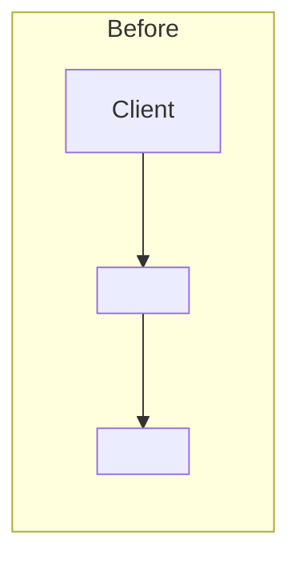
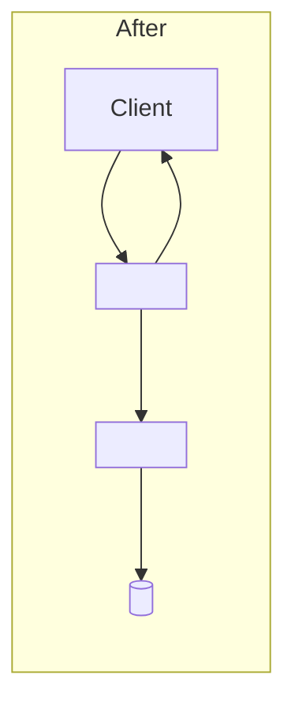

# <Capability name with clear action verb>

## Summary

Adds <capability> for <problem or constraint>.

<How it behaves from the caller's perspective>. <Most important runtime behavior>.

## Purpose

Currently, <user or system problem>.

This feature <solution and primary journey>. <What is in / out of scope>.

## Architecture

Components:

- `<Entry point>` — <responsibility>
- `<Core service or domain layer>` — <responsibility>
- `<Storage or external dependency>` — <responsibility>
- `<Background worker, if any>` — <responsibility>

Existing flow (omit if greenfield):



New flow:



## Interfaces

(Include the following points as they come up. Do not add something if not relevant).

### Endpoints

`<METHOD> </path>`

Request:

```json
{"field": "value"}
```

Response:

```json
{"field": "value"}
```

### Data / schema contracts

| Field | Type | Notes |
| ----- | ---- | ----- |
|       |      |       |

### Events or queue messages (if any)

```json
{"field": "value"}
```

### Configuration

- `<ENV_VAR>` — <purpose>; default `<value>`

## How to run

```bash
<start required services>
```

```bash
<exercise the feature>
```

Expected: <observable success condition>.
