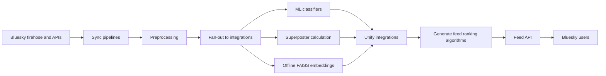

# Redesigning algorithms to intervene on social norm misperceptions during a national election

This repository is the research-grade counterpart to a large-scale live social feed: it powered a large, preregistered Bluesky field experiment during the 2024 US presidential election and bundles the full loop from live-graph ingestion and multimodal content understanding through custom ranking, participant-facing feed APIs, session logging, and export pipelines for analysis. This is an end-to-end, platform-independent stack that lets a lab design, deploy, and audit recommender behavior in the wild instead of approximating it from the outside.

## Research Context

Feed-ranking on large platforms is largely a black box: researchers cannot assign users to known algorithms, observe exposure precisely, or test alternatives at realistic scale. That blocks rigorous answers about what people actually see during elections, how ranking shapes beliefs about "normal" political talk, and whether safer designs are viable without hurting the product.

This repository is what we built to close that gap: an industry-independent, Bluesky-native research stack. It provides real-time data ingestion at the scale of tens of millions of records, ML- and API-backed enrichment, custom ranking and experiments, a live feed generator API for participants, session telemetry, and analytics-oriented exports. This showcases the full application that allows a team to run social media field experiments with full control over the recommender, not just the survey questions.

The preregistered field experiment ran through the 2024 US presidential election, a high-stakes window where data volume, rhetoric, and public attention all spike and which presented a rare opportunity to do a large-scale field study of the impact of algorithmic amplification on people's beliefs.

## What This System Does

This repo provides the end-to-end app structure for testing feed-ranking algorithms during the 2024 national election. It contains the data pipelines, AI algorithms, and API layers required to support a large-scale field study over the course of multiple months.

## Architecture At A Glance



Production work is coordinated through a hybrid research infrastructure:

- Prefect defines the high-level DAGs in `orchestration/`.
- SLURM runs scheduled jobs on the Quest HPC cluster.
- Pipeline handlers in `pipelines/` provide job entrypoints.
- Service modules in `services/` contain the core application logic.
- AWS/S3/Athena provide storage and analytical query infrastructure.
- FastAPI powers the Bluesky feed generator API in `feed_api/`.

## Data Flow

The system is organized around seven workflows (each managed by a DAG):

1. Sync pipeline: captures Bluesky firehose records and persists streamed batches.
2. Integrations sync pipeline: pulls curated Bluesky trending and most-liked feeds to supplement firehose capture.
3. Production data pipeline: preprocesses raw records, fans out classifier and integration jobs, and consolidates enrichment outputs.
4. Vector embeddings pipeline: offline Transformer embeddings, FAISS corpus index, query-vector export, and similarity Parquet for Athena.
5. Recommendation pipeline: generates candidates, then ranks and reranks candidate posts and exports personalized feeds.
6. Compaction pipeline: rewrites partitioned service exports and snapshots designated data trees.
7. Analytics pipeline: compacts study telemetry and aggregates participant activity tables for analysis.

## Repository Map

| Path | Purpose |
| --- | --- |
| `orchestration/` | Prefect DAGs and SLURM submission scripts for scheduled workflows. |
| `pipelines/` | SLURM job directories and `handler.py` entrypoints that invoke service logic. |
| `services/` | Main production, analysis, enrichment, backfill, and research service modules. |
| `feed_api/` | Bluesky feed generator API used to serve personalized feed skeletons and log sessions. |
| `ml_tooling/` | Shared ML tooling, classifier helpers, model experiments, and labeling utilities. |
| `lib/` | Shared AWS, database, telemetry, and utility modules. |
| `docs/runbooks/` | Operational runbooks for selected services and maintenance workflows. |
| `terraform/` | Infrastructure-as-code for AWS resources used by the hybrid deployment. |
| `transform/` | Helpers for transforming raw sync data into consolidated formats. |
| `scripts/` | One-off scripts. |
| `demos/` | Historical prototypes, experiments, and exploratory demos. |
| `Dockerfiles/` | Deprecated cloud-first deployment artifacts retained for reference. |

## Technical Details

- Design philosophy: The repo splits orchestration (`orchestration/` Prefect flows), batch entrypoints (`pipelines/`), application logic (`services/`), and the feed surface (`feed_api/`). Ingestion, enrichment, ranking, serving, and logging are separate stages in that pipeline.
- Hybrid architecture: Prefect-defined DAGs coordinate work across SLURM-backed HPC for heavy jobs and AWS primitives (S3, Parquet, Athena) for durable storage and analytical query, with FastAPI handling Bluesky-compatible feed delivery.
- What the build unlocked: It made a preregistered field experiment possible on an open social graph—assigning users to known ranking policies, recording what they were actually shown, and connecting that exposure stream to engagement and survey outcomes for analysis that does not rely on inferring the algorithm from the outside.

## Setup

See the [repository setup runbook](docs/runbooks/SETUP_REPO.md) for setup.

### Environment variables

Copy the template and edit values locally:

```bash
cp .env.example .env
```

Variable names and short descriptions are in [`.env.example`](.env.example). For AWS access patterns, see [`lib/aws/README.md`](lib/aws/README.md). The app loads `.env` from the repository root via `lib/load_env_vars.py` when not in test mode.

## Documentation Guide

Use these documents as the next layer of detail:

- `services/README.md`: best overall map of services, analysis modules, and ad hoc tooling.
- `orchestration/README.md`: Prefect DAGs, task ordering, and SLURM flow triggers.
- `pipelines/README.md`: job directories and their corresponding service packages.
- `feed_api/README.md`: Bluesky feed generator API and session logging flow.
- `terraform/README.md`: infrastructure-as-code and hybrid AWS/on-prem context.
- `docs/runbooks/services/`: operational runbooks for selected services.
- [`docs/runbooks/SETUP_REPO.md`](docs/runbooks/SETUP_REPO.md): local setup, dependencies, and `.env` configuration.

## License

This project is licensed under the MIT License. See `LICENSE` for details.
