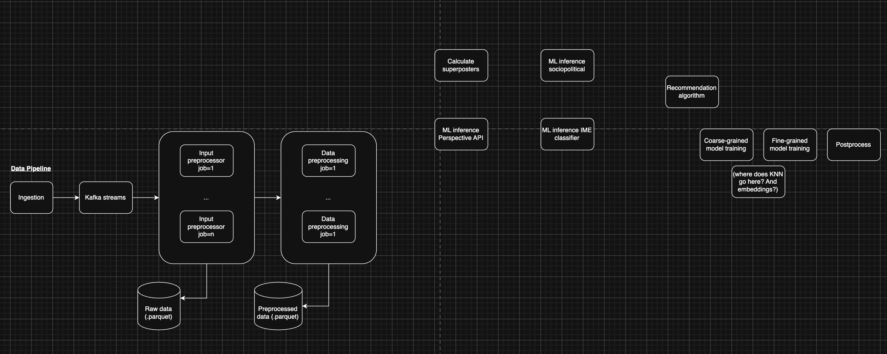
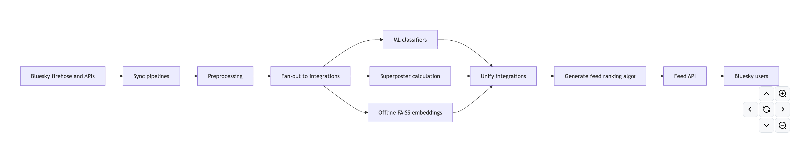

# What I learned from spending 2 years building the app for a large-scale field study

For roughly 2 years, I led the full technical build for a large-scale field-study on Bluesky. We built custom recommendation algorithms and ran them on live feeds during the 2024 US election cycle. Academically, that mattered because it let our team test algorithmic interventions in the wild—on real posts, real users, and real political moments, rather than only in settings where Big Tech controls the algorithmic layer. Personally, it mattered because it was my first chance to prove I could build a full app by myself.

Along the way, I built every line of code and implemented every piece of logic. I owned the data and ML pipelines and trained custom recommendation algorithms. I developed the APIs used by Bluesky to connect users to our feeds. I glued together all the pieces of software that made such an ambitious study possible. I trained every ML model, retraining them when they became outdated, and watched the training logs from the WandB console. I woke up at 1am to the app crashing and thousands of unhappy users not being able to log in. All 50,000 lines of code in [our codebase](https://github.com/METResearchGroup/bluesky-research) were painstakingly written, rewritten, deleted, refactored, and updated by me over the course of 2 years, a testament to how much improvement is about putting in the reps, fixing mistakes, and persevering through the doldrums rather than aphorisms, YouTube tutorials, and motivational speeches.

This is the story of what that project, over the course of two years, taught me about building software and about becoming someone who could build. When I started, I could write small pieces of code and resolve tickets. By the end of it, I not only shipped a technically impressive end-to-end piece of software, but I also became the the kind of engineer who can look at an ambitious, ambiguous project like this one and believe, based on past experience, not bluster, that I can break it into pieces and make it real.

Through the journey, I grew in three ways:

- **From self-doubt to earned confidence**: I started this project unsure whether I could truly build anything end to end, and over two years the project became the proof that I could.
- **From doing tasks to developing judgment and product sense**: I learned that specific stacks and tools don't matter, but engineering judgment. The true skill comes in knowing how to make tradeoffs, simplify problems, and build systems that actually work in the real world.
- **From isolated skills to an integrated worldview**: Before this project, I had many fragmented skills, but I lacked a unified way of seeing how research, engineering, infrastructure, and product fit together. After building this, I figured out how each of these separate components come together to make an app come to life.

To understand why that growth mattered so much to me, I have to start before the project began.

## Part 0: Before the project

In August 2023 I received news that I was being laid off. My employer was dying a slow death and I was laid off along with most of my team.

It took a few weeks to process the emotional reaction of the layoff. It was relief ("I'm glad I don't have to be up at 3am for meetings anymore"), anger ("I'll become so great and prove them wrong?"), disappointment ("I'm a disgrace of a developer") to renewal ("Now what?"), all in the span of 1-2 months, all at various beach fronts, resorts, cafes, and vacation rentals in Southeast Asia (admittedly not a terrible way to recover from a layoff).

When I had an opportunity to gather my bearings, I was unsure of how I wanted to proceed next. I felt like I didn't know how to develop software and I had little skills beyond executing tickets. I could write one-off code and PRs but I didn't have any vision for how to put things together. I could see pieces of the elephant but not the entire elephant. I also felt like my expertise (AI/ML) was (1) too niche/domain-specific, and (2) didn't give me the skills to build anything "useful". I had some experiences shipping real AI-powered apps at my previous job (e.g., classification models), but I actively advocated to work on more data engineering, backend, and DevOps tasks because I had believed that in doing those, I would learn "real" engineering skills. This left me with task-level skills ("train this model", "fix this bug", "add this new integration"), but without a unified mental framework for how these different concepts fit together and how I could combine them to build a single tangible end product. I felt frustrated that I could write code yet I didn't believe that I could actually "build".

I doubted my potential as a future software engineer. I wondered if I had actually learned anything during my previous job, whether I was actually "skilled" or whether I was hired because of my Yale pedigree, and if I could build anything of substance myself or if I would be relegated to a future of only completing tasks for projects scoped out by other people.

Buoyed by savings and my severance, I took the opportunity to explore other opportunities.

### (Mis)adventure 1: Trying to become a full-stack dev

I thought "real engineers" did full-stack, so I followed multiple coding tutorials on YouTube (e.g., "Build a Spotify clone from scratch") as well as completing multiple classes on [freeCodeCamp](https://www.freecodecamp.org/) (which is still the way that I recommend people learn to code!). I learned names of frameworks and I can count the lines of Javascript code I wrote in service of copying yet another "Build a (insert app) clone from scratch" app. However, I didn't really internalize deeper principles, both on the engineering side (e.g., "how does XYZ work internally?") and on the product side (e.g., "how do we decide what to build and why?").

### (Mis)adventure 2: Trying my hand at business

Inspired by the entrepreneurial streak of my family (my mother owned multiple restaurants), I decided to learn about running a business.

I read a few Alex Hormozi books as well as other classics such as "How to Win Friends and Influence People". I even bought an entrepreneurship course (before finding out that the way that influencers become rich is through selling you courses on how they became rich).

I didn't make much traction here, mostly because I quickly learned that I was fighting an uphill battle where I would have to start from scratch without any unique branding or offering.

### Figuring out my "unfair advantage"

At some point, I learned about the idea of an "unfair advantage" (likely from sources like [this one](https://www.diannwingertcoaching.com/blog/what-is-your-unfair-advantage)). I had failed at building traction at my misadventures related to full stack development or business. I had also, from my time in the Philippines, learned a bit about outsourced labor and reasoned that the American workforce would become increasingly global-after all, why hire an American dev for $80,000/yr when you can hire an equally qualified, English-speaking dev in the Philippines for $8,000/yr?

With this as the backdrop, I began searching for what skills and experiences I had that gave me my own "unique advantage" in an increasingly competitive workforce. The list I came up with was something like:

- High intelligence
- Work ethic
- Yale pedigree
- Silicon Valley startup experience
- AI/ML theoretical and practical experience

I reasoned that rather than starting a new venture without any unique advantages and building an online brand or reputation from scratch, I could leverage existing privileges and talents that would take others years to accumulate. From a branding perspective, I realized that the signaling conferred from the Yale and Silicon Valley brandings were associations to lean into, rather than affiliations to distance myself from. From a career development perspective, I saw the early rise of ChatGPT (my previous employer went all-in on ideas like AI agents and RAG well before those terms became mainstream) and predicted that AI/ML fundamentals (e.g., math, algorithmic understanding, etc.) were filters that would gatekeep a large proportion of up-and-coming devs interested in AI. I also reasoned that if I leaned into my statistics undergraduate education from Yale, I would further build on my AI/ML fundamentals, given that I had already done the hard part of obtaining years of rigorous math education. I predicted that the investment would exponentially pay off over the years as deeper mathematical and algorithmic understanding of AI/ML would become simultaneously more in-demand and yet be an all-too-rare skill in a world where (1) AI becomes more deeply embedded in traditional workflows but (2) fewer people would pursue the years of rigorous math education to deeply internalize how to build AI models from scratch.

I did not appreciate it then, but my choice to both explicitly state and then lean into my "unfair advantages" would become career-defining and has largely unfolded as I previously predicted, though even I didn't appreciate the degree to which it would be true.

## Part 1: Starting the project

### Learning about Bluesky

Through a series of happenstance events, I reconnected with a postdoc I worked with in college, who was now a professor at Kellogg School of Management at Northwestern University, [Dr. Billy Brady](https://www.kellogg.northwestern.edu/academics-research/faculty/brady_william/). We had chatted after our previous paper was published and I had mentioned to Billy that I was interested in a new opportunity while he had mentioned an interest in more ambitious engineering-related projects. Eventually, this led to an opportunity for me to work full-time at Northwestern.

During our discussions, Billy had mentioned to me this idea for an ambitious project related to the 2024 US election. I knew he was interested in the impact of algorithms on social learning (after all, this was his area of expertise and also was the [subject of the paper we had published](https://www.nature.com/articles/s41562-023-01582-0)). Billy had done numerous experiments demonstrating the impact of social media algorithms on warping people's perceptions of Democrats/Republicans, what issues the average American cared about, and how much people had in common vs. how much they actually differed. However, the scope of many of these experiments were limited to small in-lab applications or field studies in which the underlying algorithms were gatekept by Facebook/Twitter. A direct manipulation to the underlying algorithms to explicitly test the impacts of different modifications on users had never been tested in a live social media app outside of Facebook/Twitter (and understandably, those companies are disinclined to publish academic works against their profit motives). However, a new social media platform called [Bluesky](https://en.wikipedia.org/wiki/Bluesky) had just been announced, an offshoot from Twitter that promised to provide an open-source, open-protocol social media platform, free from deplatforming and censorship. Importantly, Bluesky offered the chance to host our own social media feeds, which meant that we could design our own feed ranking algorithms, populate them with actual live real-time posts from the Bluesky platform, and serve them to real Bluesky users within the app itself. This was an unprecedented opportunity to design algorithms ourselves and see how they would work in a real social media application.

As we talked more about the project, I began to understand the ambitious scope of the project, the impact on academia, and the technical scope of such an endeavor. When I found out about the project, I was simultaneously nervous and excited. I remember telling my partner "this project is really ambitious, but imagine what would happens if I could do it?" I had never built a full end-to-end application on my own, but I took this as an ambitious challenge that would finally allow me to learn what it means to "build" something and to be able to unashamedly identify as a "real" software engineer. I was in equal parts nervous and excited, wondering if I could pull off such an ambitious project, but excited about the outcome if it turned out that I could.

### Planning the project

As I had never built something like this before, I pored into previous literature, books, and GitHub repos to see if I could learn the prerequisite knowledge required for the project.

I took a very helpful Coursera course on recommendation algorithms. It gave me a mental framework for understanding recommendation algorithm variations (eg content-based vs. collaborative filtering) and ways to measure performance (eg recall@k). However, many of the examples were related to topics like shopping or movie recommendations, which weren’t directly relatable to building a social media app (though in large part because I didn’t realize that creating and training a recommender system was probably the easiest, least complicated part of developing a fully functioning social media pipeline).

The closest example to my use case that I found was the open-sourced version of the [Twitter algorithm](https://blog.x.com/engineering/en_us/topics/open-source/2023/twitter-recommendation-algorithm). Reviewing its components did give me one framework for designing the application, but because I didn’t have any experience yet building similar apps, the large, complicated, enterprise-heavy version of the Twitter algorithm was my only reference. I focused too much on the deeply complex technical details that needed dedicated technical teams (eg., training custom twin embedding models, scaling the social graph, etc) without understanding a first-principles design of how to build the app (get posts -> generate candidates -> filter candidates -> create feeds -> rerank feeds -> serve feeds). Without a mentor to guide me on the key details to focus on, I was both intimidated by the scale of such a project (“Twitter has hundreds of engineers working on their algorithm, how could I possibly do it?”) and attempting to make an overly complicated replication of Twitter’s version. I shudder now when looking at my first version of the system design.

This version of the design had complexity in the wrong places (e.g., using Kafka, defaulting to a fan-out architecture) and missed important details (e.g., where to store intermediate results, lack of telemetry, no data models). The rough "data -> integrations -> ML" emerged at this stage, which ended up being directionally correct, but it took a lot of learnings along the way.

This simplified version of the final system design is a bit more tool-agnostic (e.g., it doesn't explicitly mention Kafka) while preserving the core logic and making the pipeline flows explicit.

I overwhelmed myself with the pressure of trying to develop a design as “professional” as the one I had seen for Twitter. I also wanted to pattern-match against the lessons I had learned from my books and Coursera class, so I was introducing concepts like “collaborative filtering” without understanding the core algorithms or what had to be true to support them (eg to do collaborative filtering would require access to social network data, like liked posts, that I did not have).

In hindsight, I would have changed my approach. I would start with the simplest possible approach, in a single script, with max 200 lines of code. I can look at the different components that that script would have (eg a way to load posts, filter them, and then a way to generate the algorithms) and then imagine how each of those pieces would be their own units of work. When I mentor now, I often ask developers what’s their simplest possible single-script implementation of a given task, and then pair design with them to show how their simple implementation can get more complicated over time. A sign of seniority and experience that I can now better appreciate is the ability to look at functions or single lines of code, imagine where and when they’d break, and figure out how to make them more complex (and when something like that is useful versus overkill).

## Part 2: Building the app

### Initial experiments, or "running around in circles"

#### Experiments that worked out

I started with one-off scripts for individual components of the project, starting with getting the posts themselves. This approach characterized a directionally valid yet unprincipled approach towards developing the platform, where I worked on individual units of work (eg getting the posts, preprocessing them, training the models) without much thought as to how they’d fit together or a top-down vision of the end product. I mostly approached it as “I know I’ll need to get posts” or “I know I’ll need to train a model”, and built individual scripts as needed. It was only later that I’d work towards stitching them together. I describe this as directionally valid because I did end up building the basis for components I’d eventually need, but I also spun my wheels on dead-end projects.

- I experimented with [what is now known as prompt engineering](https://markptorres.com/research/llm-experiments-pt-i) before it became a popular term. I experimented with the effects of different input formats (eg YAML vs JSON) before formats like BAML became popularized.

- I also developed the foundations for my data pipeline by building record-specific integration transformations and experimenting with [different forms of language classification](https://markptorres.com/research/llm-experiments-pt-v).

- I also did some [experiments with early versions of LangChain and LlamaIndex](https://markptorres.com/self_education/llamaindex), when RAG was first picking up steam, which was my first official foray into building what are now known as "AI agents". It was a good pedagogical experience but it helped ground my impression of the agentic AI hype as the development process of such apps wasn't more difficult than other things I had previously built (this is a sentiment I hold still to this day regarding AI agents).

#### Failed experiments

However, for all of these successful experiments, I also had a plethora of failed ones.

I discovered early on that LLMs lacked context on current events, which is a problem when our sociopolitical classifier required knowledge of current events. To ameliorate this, I developed a RAG-based classifier that update a database with daily news syncs and then develops a routing-based system to figure out [which queries needed relevant current context](https://markptorres.com/research/llm-experiments-pt-iii). In hindsight, this approach was directionally right and I think a RAG-based classifier works well here here, but we decided to scrap this because (1) I had more pertinent things to build (luckily I was beginning to learn the art of prioritization), (2) the problem wasn’t common enough to merit maintaining the classifier. If I were to implement this today, I think this plan is directionally right as a basis, but I would complement it with an entity classifier and a sentiment classifier. Rather than counting on direct RAG queries to determine sentiment about a topic, which is inefficient at the scales we care about, I could repurpose the news updates pipeline to populate a database with key entities (eg politician names, bill names, etc) and the sentiment linked to each political party (eg democrats support X bill, republicans are against it). Although vastly oversimplified and incomplete (eg a person identifying as a Democrat can be against a post that the Democratic establishment), this simplified approach generally works well (which is more an indictment of the average social media user having very uncomplicated political takes that can be reduced to "Trump is good" or "Trump is bad").

I also had [another series of failed experiments](https://markptorres.com/research/llm-experiments-pt-iv) related to trying to get conservative posts and accounts from Bluesky. This shortcoming was due in large part to platform-specific population distributions, and we eventually accepted that as a limitation, but I spent too long trying to find clever workarounds for this problem, such as upsampling certain accounts or trying (in vain) to scour through the firehose of daily posts to find the conservative needle in the liberal haystack.

### Seeing how different pieces fit together towards one result

Slowly but surely, I was building the individual pieces of the final pipeline and as a result developing an end-to-end app.

I hit practical questions along the way that forced me to learn the unglamorous yet necessary parts of stitching together different units of work into a single cohesive workflow, such as:

- Storing intermediate results
- Which units of work to combine into a single service, and which to split.
- What services should be dependent on other ones
- Where to look at in the pipeline if something breaks.
- How to guarantee that the output of one part of the pipeline is correctly passed as input to the next part of the pipeline.
- How to package up services so that they run the same way in a different environment as they do on my computer.

As I was building each piece incrementally, I could see the gaps that had to be filled in order to connect them. For example, as I was building the data ingestion and preprocessing components in parallel, I needed to think about concerns like data contracts (to make sure that the output of the data ingestion could be consumed by the preprocessing step), orchestration (would preprocessing be run right after data ingestion? Or separately?), and scale (did my transformations work if I had 1M posts? If not, could I either optimize the transformations or make the units of work smaller?).

This resulted in me being able to finally learn the hard parts of building a real end-to-end app from scratch. Unlike in my previous role, where I largely implemented individual tickets and saw only "parts of the elephant", I could build something for myself end-to-end, thereby "seeing the full body of the elephant" and being able to build a full application from scratch on my own.

### Improving technical fundamentals

With additional reps, I deepened my technical fundamentals. Without others to cover my weak points, I learned topics such as data engineering, DevOps, and MLOps. My process for doing this looked something like:

- I faced tangible problems (e.g., "how do I make sure that I know how I trained my model")
- I internalized the deeper fundamental concepts (e.g., "what I really need is to track my metadata, data I used for the model, hyperparameters, etc.")
- I developed a "good enough" solution for my immediate problem (e.g., "at each point, just track the necessary data")
- As building a "good enough" solution became insufficient, I looked up solutions and online tutorials (e.g., "this is what MLFlow is for").
- As needed, I started incorporating other tools and pieces of software, but not without first deeply understanding the problem that these solved.

Rather than being typecast into a single role like "data scientist" or "ML engineer", I developed a larger breadth of general technical skills. I became more like a ["T-shaped engineer"](https://alexkondov.com/the-t-shaped-engineer/), learning a little of everything, enough to build full software applications on my own, but having a specialty (in my case, AI/ML) that I was especially proficient in.

### Finding creative solutions around constraints

For the project, I hit practical limitations that forced me to be creative in my implementation. For example, using AWS for large parts of the pipeline turned out to be cost-prohibitive, especially given that Northwestern already manages their own on-prem cluster. Because of this, I developed my own versions of AWS services, tailored to exactly what I needed and constrained to the cluster's limitations (namely, lack of always-persistent runtimes and strict network access protocols).

These limitations removed access to AWS compute services as well as limited me from running long-lived servers (e.g., Kafka, Prometheus) on-prem. Therefore, I had to adapt my pipeline to be batch-native, running on cron jobs and persisting intermediate results. This was all stitched together by me logging into the cluster every day and making sure that the jobs running in the cluster were running as expected. The only thing that had to be "long-lived" was the persistent connection to the Bluesky firehose to get new records, which I ran on 7-day jobs on the cluster and I would set alerts and alarms for myself to make sure that I could restart the firehose job before it timed out. I also developed [my own lightweight SQLite-based queue](https://markptorres.com/research/2025-01-31-effectiveness-of-sqlite) which worked well enough to store intermediate results across each step of the pipeline.

I also learned to [work in an HPC environment](https://markptorres.com/personal/2025-01-15-setting-up-zsh-hpc), which quickly taught me that I would be doing as little development work in HPC as possible (it's clunky to set up and the VSCode connection to it is laggy) and to treat the HPC environment as my "prod" server. (forced me to set up a quasi-CI/CD pipeline, where I had my playbooks for how to "deploy to prod").

I also learned to think critically about mainstream technical advice. For example, I write about [why we assume serverless is necessarily better](https://markptorres.com/personal/2025-01-22-serverless-vs-server), which is a piece of advice that I had naively accepted early in my career. It's not to say that it doesn't have its place, but rather than accepting it blindly as ground truth, I learned when it works well and when it doesn't. This tenet can be applied to all pieces of software advice (and, frankly, any advice) and as I was building more and more, I become more comfortable reviewing advice, matching it against my experience, and forming my own opinions about it.

**All of these constraints ended up being a pedagogical blessing in disguise**. Because I couldn't use many popular tools out-of-the-box, I had to build my own simplified implementations of each. As a result, I ended up having a much deeper understanding of concepts like queues, caching, event-driven architectures, and ML training pipelines. I couldn't abstract those concepts away with a config-driven call to an AWS services. I had to instead write scripts to do these tasks, create my own abstractions, and run as jobs on an on-prem server.

### Career learnings at this stage

#### Fix problems

Your value as an engineer is tied to your ability to [fix problems](https://markptorres.com/personal/2024-06-12-best) and drive results. I learned quickly that nobody in academia knew tech terms like "AWS", "orchestration" and "telemetry", but they did care that we could, for example, create custom feeds that showcased the specific interventions.

#### Make sure your work is valuable

Your value as an engineer extends beyond code. [Knowing how to code isn't enough](https://markptorres.com/personal/2024-06-24-knowing-how-to-code-isnt-enough). Though I wrote this blog post with more of an eye towards taking ownership of one's career, a throughline here that holds true is making sure to closely align your work to whatever is deemed most valuable in your workplace. Code is just one part of that. You have to communicate what you're doing and keep a pulse on what everyone else thinks is important. You have to practice progressive disclosure: figuring out the right time to make certain pieces of information known. You need to underpromise and overdeliver.

#### Communicate what you think is important in language matching what stakeholders think is important

For example, my academic peers may not understand the particulars of GPU compute requirements, but if I frame it as "this is the investment we need to train the models required for our ranking algorithms, which is the core innovation of our study", then they're much more on-board.

#### Implementation quality matters insofar as it affects product quality today and in the future

The purpose of coding, in my eyes, is twofold: (1) creating a quality end product today, and (2) being able to continue to do so in the future. That result could be an app, a piece of analysis, an ML model, whatever it may be. However, code has value insofar as it supports this enterprise.

We can interpret best practices in software engineering through this lens:

- **Code quality**: it's hard to build features or grow apps if you have abstruse logic, spaghetti code, or duplicate functions. Imagine the headache that comes if you have three backend functions that manage user authentication. Cleaner code (well-designed abstractions, design patterns, etc.) results in easier-to-understand transformation logic (e.g., "this part of the code handles all text preprocessing, nowhere else") and a smaller blast radius for making changes (e.g., "if I want to change the color of this button, I know I need to only touch this 1 line of code").
- **DevOps practices (telemetry, testing, CI/CD)**: it's hard to confidently ship an app and expose it to live users if you don't know if and when it'll break, under what conditions it might break, and how you'd recreate any bugs that users experience. It's also hard to add new features if you're not sure if changing the color of a button will suddenly shut off functionality for 10,000 of your users.
- **Data contracts and validation**: It's hard to trust downstream analysis or write reliable code if you don't know what fields a given piece of data will or won't have. You'll have to add various lines of exception handling for all the cases where data may or may not have certain fields or values. It also is more difficult for new engineers to onboard to the codebase as they will have a difficult time reasoning through the data transformation logic through the pipeline (e.g., "does the 'user' object here have a list of their posts, or no?").
- **Modularity and decoupling**: If one line of your code goes down, ideally the impact of that would be as isolated as possible. We wouldn't want, for example, a user inputting an age value of 999 into a form to somehow lead to buttons breaking for other users. In addition to isolating the blast radius of mistakes, decoupled code, services, and logic are also easier to refactor and swap and build on top of. For example, if your ML services have a shared set of functions for training, deploying, and integrating into your pipelines, that's shared scaffolding that can be used so that the next ML model can be defined in 10-50 lines of code rather than 1,000 lines of code.

## Part 3: Running the study

## Part 4: Writing up what we did

## Part 5: Aftermath

## Part 6: What I'm working on now

## Part 7: Where I'd like to go next
