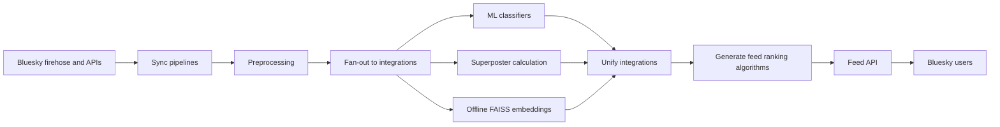

## What we built

## Why did we need to build this in the first place?

## How did Bluesky make this possible?

## Architecture at a glance

## Deeper dive into the architecture

### Data ingestion

### Preprocessing

### Enrichment

#### ML classifiers

We used a variety of ML classifiers for the project ...

### Recommendation algorithms

### Serving

### Observability and Ops

### Infra and deployment

## Tradeoffs we made

## Where I'd likely change it up now

### DevOps from the start

