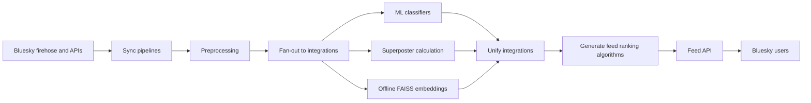

## What we built

## Why did we need to build this in the first place?

## How did Bluesky make this possible?

## Architecture at a glance

At a high-level, the app is designed around the following components:

1. Data ingestion: the app connects to the real-time Bluesky data stream.

## Deeper dive into the architecture

### Data ingestion

For the data ingestion module, we connected to the Bluesky real-time data stream (firehose). Bluesky publishes events that happen on the platform ("user X likes post Y", "user Z made a new post") in real time. In a move unprecedented, Bluesky chose to make this data publicly available.

#### What alternatives did we consider?

We considered, but eventually moved away from, the following alternatives:

- The Bluesky API: Bluesky maintains a public API. We used this for small-scale tasks (e.g., getting the current profile for a user). However, ...
- Web scraping: ...
- PDS backfills: 
- Jetstream: 

#### Tradeoffs from using the data stream

##### App behavior coupled to spikes/crashes from the Bluesky side

...

##### Somethign else ...

### Preprocessing

### Enrichment

#### ML classifiers

We used a variety of ML classifiers for the project ...

### Recommendation algorithms

### Serving

### Observability and Ops

### Infra and deployment

## Tradeoffs we made

## Where I'd likely change it up now

### DevOps from the start

