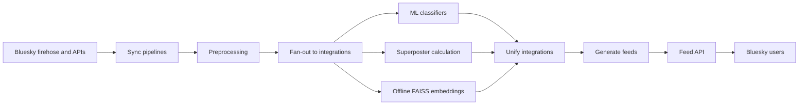

## What we built

## Why did we need to build this in the first place?

## How did Bluesky make this possible?

## Architecture at a glance



At a high-level, the app is designed around the following components:

1. Data ingestion: connecting to the real-time Bluesky data stream and getting live records.
2. Data processing: taking the ingested records, filtering invalid records, and enqueueing to downstream services.
3. Integrations fan-out: running the enrichment integrations (ML classifiers, superposter calculation, vector embedding generation) and labeling the latest batches of posts.
4. Consolidate/unify enriched posts: aggregating the labels from the various enrichment integrations and creating a single representation for a post.
5. Generating feeds: given the pool of available posts as well as algorithm implementation details, generating feeds for all users and persisting to S3.
6. Serving feeds to users: deploying a FastAPI backend to connect to Bluesky and host feeds. Users would log into our Bluesky feed link and then the Bluesky client would ping our server, grab the latest feeds, and serve to the user.

## Deeper dive into the architecture

### Data ingestion

For the data ingestion module, we connected to the Bluesky real-time data stream (firehose). Bluesky publishes events that happen on the platform ("user X likes post Y", "user Z made a new post") in real time. In a move unprecedented, Bluesky chose to make this data publicly available.

#### What alternatives did we consider?

We considered, but eventually moved away from, a few alternatives.

##### Bluesky API

Bluesky maintains a public API. We used this for small-scale tasks (e.g., getting the current profile for a user). The endpoints from Bluesky are much more fully hydrated (e.g., the GET /posts endpoint has post text, engagement data, etc) but the throughput was too low for our scale (I forget the exact rate limits, but I think the total data we could have collected was on the level of low thousands per day at most, when we were collecting easily 1,000x that for our pipelines). In addition, if we manually polled users we wouldn't be able to know when to scrape data for a user. Most users weren't particularly active, so we could likely have pinged the API for their data every few days. However, there were a few power users who posted and engaged with content every single day. In addition, we needed to know what content users liked, and the like data isn't readily available in the API.

##### Web scraping

I tried a few experiments with Selenium to develop web scrapers that crawled a user's feed to get their posts and liked posts. This did not work particularly well, as it both failed to capture content from power users and also was prone to false negatives. I retried this when AI computer agents were first introduced. Those experiments yielded perhaps 30 posts in 30 minutes of waiting for the AI agent to scroll the page. They've very likely gotten much better, but I anticipate that doing it at scale would've gotten the AI agent session throttled by Bluesky (plus racked up quite a tab for myself).

##### PDS backfills

The Bluesky data stream is a live firehose of real-time data. However, if one isn't able to gather data in real-time, Bluesky provides ways to [traverse the PDSes](https://github.com/bluesky-social/pds) which store the data publicly.

I used this approach to backfill records that I did not have. For example, we tracked the like records from the real-time firehose. However, these like records were very sparse, only having the like ID and the user who liked the post. To analyze anything about the posts that were liked, I had to figure out how to backfill records by traversing the PDSes.

The way to do this wasn't documented at all online when I was building it out, and I had to piece it together from checking the Discord chats and asking questions to the Bluesky devs. Frankly I'm unsure if I truly understand how it works, as I still don't 100% understand Bluesky's underlying architecture, but [I implemented a solution to backfill records](https://github.com/METResearchGroup/bluesky-research/tree/main/services/backfill/pds_backfills).

This approach worked OK but had low throughput and often disconnected. It did not capture data at the scale that we would've wanted for the study.

##### Bluesky Jetstream

Bluesky recently introduced [Jetstream](https://github.com/bluesky-social/jetstream), a streamlined way to backfill records. This did not exist during the study, though we've experimented with it in the lab for [other use cases](https://github.com/METResearchGroup/lab_data_integrations_interface/pull/5). This is much more feasible to do than the manual backfill that I was doing before and has a much higher QPS. Backfills are now no longer as gruesome and I actually would likely couple this with the firehose to have a hybrid ingestion architecture with both real-time ingestion and batch backfills.

#### Tradeoffs from using the data stream

The choice to use the data stream came with a few tradeoffs.

##### App behavior coupled to spikes/crashes from the Bluesky side

The expected load on our system was closely coupled to the load from the data stream. When there was heavy traffic on Bluesky, our app experienced heavy traffic as well. When Bluesky crashed

We learned to manage this in the following ways:

- Decouple data persistence from live ingestion: during times of high throughput, the ingestion job was rate-limited by write throughput. I resolved this by splitting ingestion into 2 parallel jobs: a job that writes the data stream in-memory to a `temp/` output as .json files and a job that takes those records and writes them to permanent .parquet storage. This also had the additional benefit of reducing the number of .parquet files we had to write (thereby better leveraging parquet's columnar format).
- Decouple downstream services from data ingestion: ingested records were both written to permanent parquet storage as well as enqueued for downstream services. Rather than triggering downstream services after the data ingestion pipeline or creating an event-driven architecture, I chose to instead explicitly decouple the runtimes for the data ingestion and data processing services. I formalized this through the use of separate orchestration DAGs for both layers, meaning that the data processing and downstream jobs could just run on whatever data, if any, were enqueued from the upstream data ingestion layer.

##### Have to know upfront what data you want

Using the data stream requires that you know upfront which records you want. If I had to collect a new data type, I would have to restart the connection to the data stream and manually add in a filter for that data type, and then if we wanted records prior to today, I would have to backfill those manually.

##### Inevitable downtime periods

I needed long-lived persistent servers, but this wasn't available on HPC. I ran the longest jobs I could, 7-day persistent jobs, and then manually restarted them. I set up the jobs to email me whenever they finished, and I also created a small cronjob that polled the job scheduler to see if the job was finished or not, and automatically submitted a new job once one ended.

Inevitably, there would be a few minutes of downtime between when a data ingestion job finished and when the job scheduler would enqueue and run the request for the next data ingestion job. This meant that for a few minutes, we may have missed some activity. However, this likely had a negligible impact, as (1) it was a few minutes in a week (<10 minutes) and (2) I scheduled this to happen in the afternoon Asia time (as I was traveling abroad at the time), which would mean late evening US time, and I doubted anyone would have meaningful social media activity at 3am (and if they do, they need to sleep!). Even with this downtime, we still had three nines of availability.

### Preprocessing

I developed a preprocessing service that would do basic cleaning (e.g., standardize text) and filters (e.g., removing non-English texts, remove posts from blacklisted accounts, etc).

Simple, straightforward service. Only complications were around getting estimates for how many records we could comfortably hold in memory. I had a memory-inefficient approach at first (turns out Pandas indexes are expensive!) and had to be careful about duplicating dataframes in memory, especially as I began filtering multiple millions of posts at a time. I more aggressively implemented inplace transformations and prioritized using the vectorized functionalities offered by Pandas.

Given what I know now, I likely would've explored some of the following options;

- Explore [predicate pushdown](https://www.dremio.com/wiki/predicate-pushdown/): rather than doing the filters in-memory, I would've checked to see if I could've pushed some of the filters to the DuckDB + SQL layer. For example, our basic excludelist filtering could've been done as a SQL query.
- Using Polars instead of pandas: I've seen some convincing online content and I've done some light experiments myself demonstrating Polars improvements over Pandas. I'm unsure how well it would do for this specific task, but it would be something to explore.

### Enrichment

#### ML integrations

We used a variety of ML-related integrations for the project:

##### Google's Perspective API

I used the Perspective API from Google (set to be deprecated end of 2026) which has been a popular tool in the social science community for classifying things like toxicity. For this project we used it to classify a variety of endpoints like cosntructiveness and moral outrage. I actually helped [develop a moral outrage classifier](https://static1.squarespace.com/static/538ca3ade4b090f9ef331978/t/674ce2cd6bb1423092f89021/1733092050119/2023+Nat+Hum+Behav+overperception+%2B+editorial.pdf) in undergrad, but Google's Perspective API was more performant. I write more about what I was doing in [this blog post](https://markptorres.com/research/llm-experiments-pt-vi). Developing this classifier was straightforward and the API was free and consistently reliable. We were getting up to 100 QPS (which, at ~360,000 posts/hr, was OK enough for our scale), but if we wanted to scale this further, we might have to consider either (1) getting multiple API keys or (2) distilling our own models based on the Perspective API labels and then running them side-by-side.

##### LLM-based classification

I developed LLM-based classifiers for questions like "does this post have political content?". I wrote about this in a series of blog posts:

- [Investigating JSON vs. YAML](https://markptorres.com/research/llm-experiments-pt-vii) for prompts.
- [Exploring a quasi-RAG architecture](https://markptorres.com/research/llm-experiments-pt-iii), which I eventually scrapped.
- [Experimenting with how many posts can be batched into a single prompt](https://markptorres.com/research/llm-experiments-pt-ii) without reducing accuracy.
- [Initial experiments with LLMs as a political classifier](https://markptorres.com/research/llm-experiments-pt-i)

These experiments gave me in-depth hands-on exposure with LLM providers, tradeoffs between them, and concepts like structured output and TTFT (time-to-first-token) that had meaningful impacts on project performance. For our project I largely used `gpt-4o-mini`, which did well enough on a local test set (having a recall >= 0.8, as per [these results](https://markptorres.com/research/llm-experiments-pt-i)), though when `gpt-5-nano` became available I pivoted to that as well.

I did more [rigorous experiments later on](https://github.com/METResearchGroup/bluesky-research/pull/316), as I fleshed out an LLM-based intergroup classifier, introducing [Opik](https://github.com/METResearchGroup/bluesky-research/pull/316) for LLM telemetry and more closely investigating if [prompt batching had any meaningful impact as compared to threaded concurrency](https://github.com/METResearchGroup/bluesky-research/pull/369).

```markdown
Batch size	Current (1 req/post)	Prompt batched (20 conc, 10/post)
1	7.60	2.05
10	12.33	10.86
50	14.63	13.81
100	18.38	18.76
200	19.43	17.90
400	31.21	30.26
600	36.13	37.24
800	46.12	54.95
1,000	53.01	64.46
1,200	71.51	76.70
1,500	93.41	117.11
2,000	124.29	136.62
2,500	141.85	162.76
3,000	155.56	178.98
4,000	238.66	273.86
5,000	260.22	319.32
```

I was surprised to learn that just having 1 post per request and then trying to maximize the number of concurrent requests actually was faster than batching 20 posts into a single request. I figured that the batched version would be handicapped by token generation time, and I thought that the p95 of more requests would be worse so therefore the total completion time would be larger for 20 requests than 1 request, but the experiments seem to suggest otherwise.

##### Vector-based embeddings

I also generated vectors for the posts. I did this in an offline batch pipeline and used it as part of our personalization layer (for example, by upranking posts similar to those previously liked). This was more expensive and time-consuming than other parts of the pipeline, so I also explored a sampling approach, doing this for subsets of posts at a time.

Generating vector embeddings for this use case did slightly improve feed quality, though a much more thorough implementation would've developed two-tower models. I did not have the bandwidth to build that nor the dataset sizes available to do so, but it would be an interesting follow-up project that I'd like to investigate.

### Recommendation algorithms

The recommendation algorithm we developed for the paper was one of its key innovations of the paper. For this, we created a new algorithm that took as its base a generic engagement-based algorithm and explicitly downranked toxic content and upranked constructive content. For the engagement algorithm, we weighed a linear combination of content personalized to that user (using embedding similarity) and content generally engaging on the platform (as measured by, for example, likes).

### Serving

I developed a FastAPI backend and deployed it in a persistent EC2 instance. In hindsight I wish I had used something like Railway or AWS App Runner, which would've saved me the multiple days required to set up networking and permissions. When serving the posts, I had first tried to introduce a Redis cache layer, but the traffic was infrequent enough that maintaining a persistent external cache server didn't make sense.

Next, I had tried a "serverless Redis" solution that I found. But, latency was much too high due to the cold start problem (and in fact, the Bluesky client sometimes timed out).

Instead, I went with an in-memory cache, keyed on user ID. Requests would pull from the cache first, and then if there were no cache hits, the API would pull from S3. However, cache misses were pretty rare. Every so often, we would check S3 to see if there were new feeds, and we tried to align this to have the same cron schedule that the feed generation algos had. Of course, since the two weren't strictly coupled, there perhaps were times where we checked and there were no new feeds, but it was in progress. This was an OK lossiness, as we didn't need in-real-time updates. We increased the frequency that the server pinged for new feeds to compensate and this was a "good enough" fix.

### Observability and DevOps

Observability and DevOps were admittedly late additions to development.

...

(I added Prometheus and Grafana for smaller one-off pipelines, but these never made it to production. A big blocker was that my production pipelines were hosted on-prem, but I couldn't host a server on-prem).

With hindsight, I would've liked to have adopted more observability and DevOps principles. (even if we can't run Grafana or other tools locally, we could've stored the logs, pushed to S3, and then just built a layer on top, especially if we didn't need real time - can Grafana or Prometheus be configured for this?)

(testing? should I discuss that?)

### Infra and deployment

This app was deployed on a hybrid AWS + on-prem layer. I first investigated and proposed an AWS-only build, but the hundreds of dollars per month that it would cost seemed unnecessary when compared to the already plentiful and freely available compute and storage already available at Northwestern.

Of course, using Northwestern's compute meant no access to AWS services like DynamoDB or SQS. It also meant no access to always-on jobs. The pipeline runtimes were defined by Prefect orchestration DAGs, which were themselves triggered by cron jobs scheduled as 7-day jobs on-prem.

I was able to use AWS for a few components in the study:

- Persistent API layer: The FastAPI backend was hosted on S3.
- Blob/backup storage: S3 provided plentiful blob storage as well as for backups and archival storage.
- Analysis: Running large-scale queries was much more effective in Athena as compared to running Python scripts.
- DynamoDB: Some user data was stored in DynamoDB (since it had to be available to consumers both on-prem and in the API hosted on EC2). I also stored some job metadata there as well out of preference.

## Where I'd likely change it up now

### DevOps from the start
