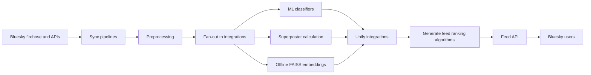

## What we built

## Why did we need to build this in the first place?

## How did Bluesky make this possible?

## Architecture at a glance

At a high-level, the app is designed around the following components:

1. Data ingestion: the app connects to the real-time Bluesky data stream.

## Deeper dive into the architecture

### Data ingestion

For the data ingestion module, we connected to the Bluesky real-time data stream (firehose). Bluesky publishes events that happen on the platform ("user X likes post Y", "user Z made a new post") in real time. In a move unprecedented, Bluesky chose to make this data publicly available.

#### What alternatives did we consider?

We considered, but eventually moved away from, a few alternatives.

##### Bluesky API

Bluesky maintains a public API. We used this for small-scale tasks (e.g., getting the current profile for a user). The endpoints from Bluesky are much more fully hydrated (e.g., the GET /posts endpoint has post text, engagement data, etc) but the throughput was too low for our scale (I forget the exact rate limits, but I think the total data we could have collected was on the level of low thousands per day at most, when we were collecting easily 1,000x that for our pipelines). In addition, if we manually polled users we wouldn't be able to know when to scrape data for a user. Most users weren't particularly active, so we could likely have pinged the API for their data every few days. However, there were a few power users who posted and engaged with content every single day. In addition, we needed to know what content users liked, and the like data isn't readily available in the API.

##### Web scraping

I tried a few experiments with Selenium to develop web scrapers that crawled a user's feed to get their posts and liked posts. This did not work particularly well, as it both failed to capture content from power users and also was prone to false negatives. I retried this when AI computer agents were first introduced. Those experiments yielded perhaps 30 posts in 30 minutes of waiting for the AI agent to scroll the page. They've very likely gotten much better, but I anticipate that doing it at scale would've gotten the AI agent session throttled by Bluesky (plus racked up quite a tab for myself).

##### PDS backfills

The Bluesky data stream is a live firehose of real-time data. However, if one isn't able to gather data in real-time, Bluesky provides ways to [traverse the PDSes](https://github.com/bluesky-social/pds) which store the data publicly.

I used this approach to backfill records that I did not have. For example, we tracked the like records from the real-time firehose. However, these like records were very sparse, only having the like ID and the user who liked the post. To analyze anything about the posts that were liked, I had to figure out how to backfill records by traversing the PDSes.

The way to do this wasn't documented at all online when I was building it out, and I had to piece it together from checking the Discord chats and asking questions to the Bluesky devs. Frankly I'm unsure if I truly understand how it works, as I still don't 100% understand Bluesky's underlying architecture, but [I implemented a solution to backfill records](https://github.com/METResearchGroup/bluesky-research/tree/main/services/backfill/pds_backfills).

This approach worked OK but had low throughput and often disconnected. It did not capture data at the scale that we would've wanted for the study.

##### Bluesky Jetstream

Bluesky recently introduced [Jetstream](https://github.com/bluesky-social/jetstream), a streamlined way to backfill records. This did not exist during the study, though we've experimented with it in the lab for [other use cases](https://github.com/METResearchGroup/lab_data_integrations_interface/pull/5). This is much more feasible to do than the manual backfill that I was doing before and has a much higher QPS. Backfills are now no longer as gruesome and I actually would likely couple this with the firehose to have a hybrid ingestion architecture with both real-time ingestion and batch backfills.

#### Tradeoffs from using the data stream

The choice to use the data stream came with a few tradeoffs.

##### App behavior coupled to spikes/crashes from the Bluesky side

...

We learned to manage this in the following ways:

- To manage spikes: I decoupled data persistence from ingestion. We introduced a ...

##### Something else ...

### Preprocessing

### Enrichment

#### ML classifiers

We used a variety of ML classifiers for the project ...

### Recommendation algorithms

### Serving

### Observability and Ops

### Infra and deployment

## Tradeoffs we made

## Where I'd likely change it up now

### DevOps from the start

